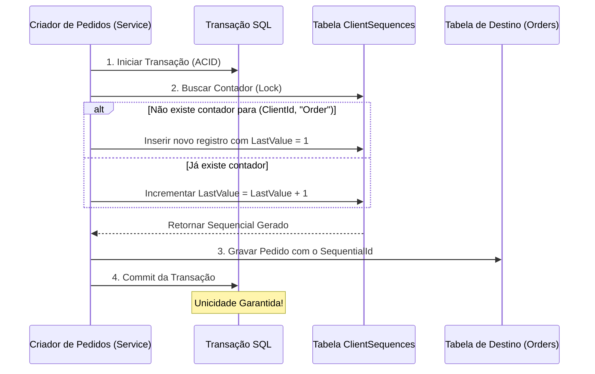

# 090 - Identificadores Sequenciais Amigáveis Escopados por Cliente (ACID & Idempotente)

Este documento registra as decisões arquiteturais, especificações técnicas e o fluxo de funcionamento do sistema de **Identificadores Sequenciais Amigáveis** (`SequentialId`) implementados no ecossistema **Media8**.

---

## 👥 Resumo para Leigos (O que é e por que foi feito?)

### O Problema
Anteriormente, para acessar qualquer tela ou identificar um item (como um contrato ou pedido), o sistema usava códigos internos longos e complexos (chamados UUIDs ou GUIDs), parecidos com isso: `c839a1b2-10f5-4de9-b7d7-78ba3396b160`.
* **Sem Identificação Simples:** Era impraticável para o cliente ou para o suporte técnico se referir a um pedido falando *"Por favor, verifique o pedido c839a1..."*.
* **Sem Noção de Ordem:** O cliente não sabia se aquele contrato era o seu primeiro, segundo ou décimo contrato na plataforma.

### A Solução
Criamos um sistema de **numeração amigável sequencial específica de cada cliente**.
* Cada cliente agora tem seu próprio contador privado.
* O primeiro contrato do cliente será o **Contrato #0001**, o segundo o **Contrato #0002**, e assim por diante.
* O mesmo ocorre para Pedidos (**Pedido #0001**), Faturas (**Fatura #0001**), Perfis de Marca (**Marca #0001**) e Perfis de Edição (**Perfil #0001**).
* **Isolamento e Segurança (Anti-IDOR):** Um cliente nunca verá a numeração de outro cliente, e um cliente não pode tentar adivinhar a numeração de outro para acessar dados indevidos, pois todas as buscas na API cruzam de forma estrita o seu ID de login com o seu número sequencial específico.

---

## 💻 Resumo para Programadores (Arquitetura e Padrões)

### 1. Separação de Responsabilidades (Backend vs. Frontend)
* **Backend (State & Persistence):** Armazena o identificador como um número inteiro bruto (`int SequentialId`) no banco de dados. O backend **não** concatena strings como `"Contrato #"` ou adiciona zeros à esquerda. Isso mantém os dados limpos, indexáveis e abertos para cálculos de banco de dados.
* **Frontend (Presentation - DRY):** Recebe o inteiro bruto e realiza a formatação visual (ex: preenchendo zeros à esquerda e concatenando o prefixo da marca ou do pedido) através de uma função utilitária única `formatSequentialId` no arquivo `src/lib/formatters.ts`. Isso permite alterar a exibição visual de forma instantânea sem precisar recompilar ou rodar migrações de banco.

### 2. Controle de Concorrência ACID (Atomicidade e Idempotência)
Para garantir que duas requisições simultâneas feitas pelo mesmo cliente não gerem o mesmo número sequencial (colisão de IDs), implementamos a estratégia da **Tabela de Contadores por Cliente (`ClientSequences`)**:



* **Atomicidade:** A busca, incremento e gravação acontecem sob uma única transação isolada de banco de dados, bloqueando a respectiva linha de contagem para aquele cliente específico enquanto a operação não é concluída.
* **Índices de Unicidade Estrita:** Configuramos restrições exclusivas (`Unique Indexes`) compostas em nível físico no banco de dados PostgreSQL via Entity Framework Core:
  * `ClientSequence`: Índice único em `(ClientId, EntityType)`.
  * `ClientContract`: Índice único em `(ClientId, SequentialId)`.
  * `Order`: Índice único em `(ClientId, SequentialId)`.
  * `Invoice`: Índice único em `(ClientId, SequentialId)`.
  * `BrandingProfile`: Índice único em `(UserId, SequentialId)`.
  * `EditingProfile`: Índice único em `(UserId, SequentialId)`.

### 3. Backfill Retroativo de Histórico (Migração Segura)
Ao adicionar uma coluna `NOT NULL` inteira a tabelas com dados pré-existentes, o banco de dados atribui o valor padrão `0` a todas as linhas anteriores. Isso geraria uma violação de unicidade imediata se criássemos o índice único em seguida.

Para solucionar isso, implementamos uma instrução SQL avançada em CTE utilizando a função `row_number() OVER (PARTITION BY ...)` de forma customizada dentro do arquivo da migração física:

```sql
-- Distribui IDs sequenciais retroativamente para o histórico de cada cliente
WITH Ranked AS (
  SELECT "Id", row_number() OVER (PARTITION BY "ClientId" ORDER BY "CreatedAt") as rn
  FROM "ClientContracts"
)
UPDATE "ClientContracts" cc
SET "SequentialId" = Ranked.rn
FROM Ranked
WHERE cc."Id" = Ranked."Id";

-- Pré-popula a tabela de contadores para que os próximos criados partam do valor correto
INSERT INTO "ClientSequences" ("Id", "ClientId", "EntityType", "LastValue", "CreatedAt", "UpdatedAt")
SELECT gen_random_uuid(), "ClientId", 'Contract', MAX("SequentialId"), now(), now()
FROM "ClientContracts"
GROUP BY "ClientId";
```

Esta estratégia garantiu um backfill 100% íntegro sem perda de dados históricos ou travamento de deploy.

---

## 🛠️ Especificações do Código

### Função Formatora no React (`formatters.ts`)
```typescript
export const formatSequentialId = (
  id?: number | null,
  prefix: string = '',
  digits: number = 4
): string => {
  if (id === undefined || id === null || id <= 0) return '';
  const formattedNumber = String(id).padStart(digits, '0');
  return prefix ? `${prefix} #${formattedNumber}` : `#${formattedNumber}`;
};
```

---

## 🎯 Impacto Comercial e Operacional
* **Facilidade de Comunicação:** Clientes e Suporte conversam referenciando `"Pedido #0012"` ou `"Contrato #0004"`.
* **UX de Alto Nível:** Sensação de organização premium e profissionalismo, espelhando grandes plataformas SaaS do mercado.
* **Escalabilidade Multitenant:** Estrutura pronta para suportar milhões de clientes e centenas de transações simultâneas sem risco de sobreposição ou vazamento de escopo.
