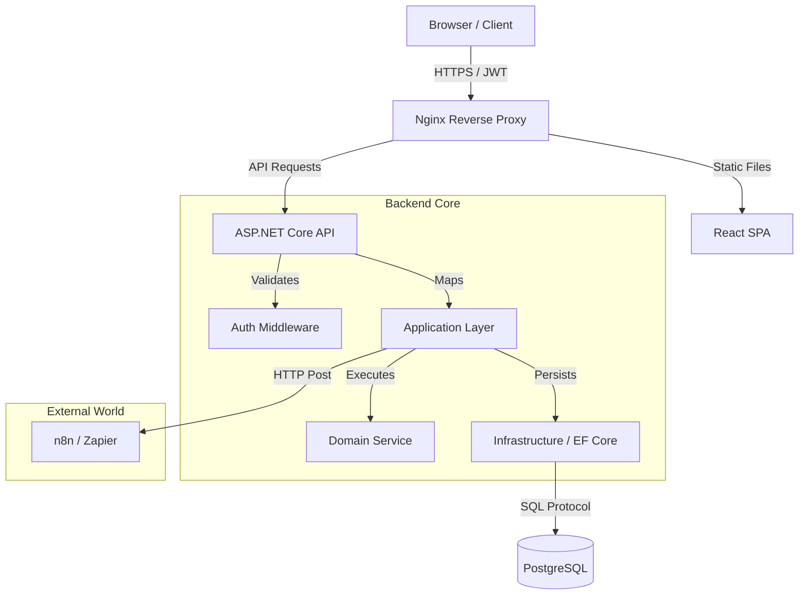
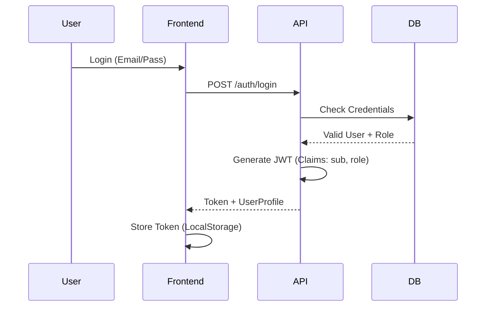
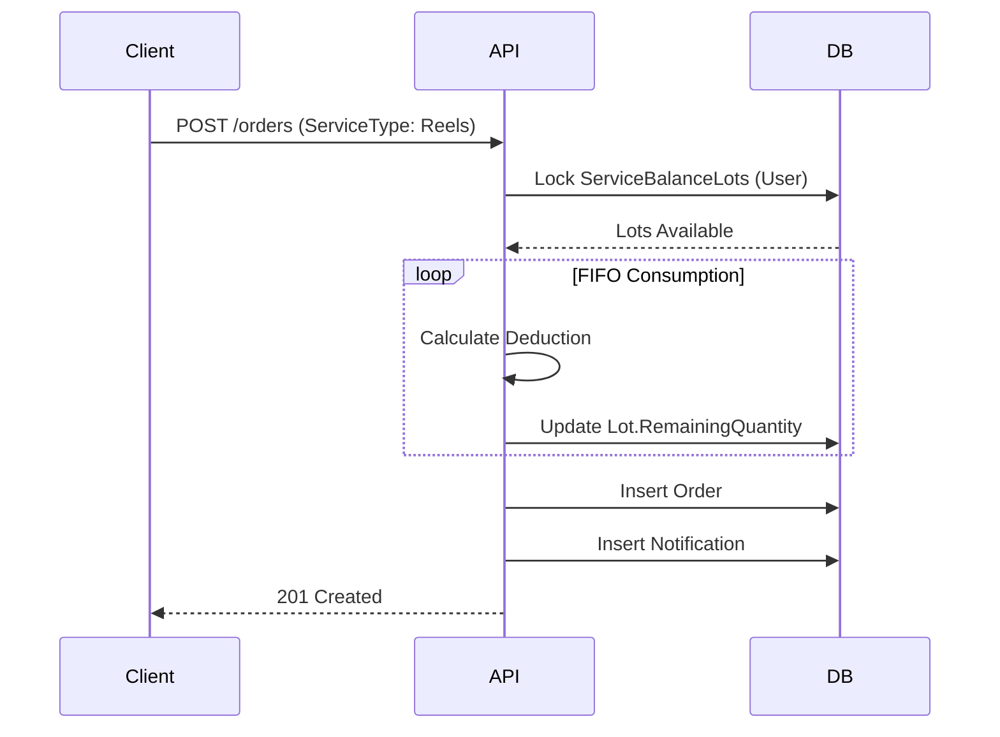

# Media 8 - Arquitetura do Sistema

> **Visão Técnica**: Este documento detalha as decisões de design, padrões e fluxos de dados que compõem a plataforma Media 8.

---

## Sumário

1. [Visão Geral](#visão-geral)
2. [Stack Tecnológico](#stack-tecnológico)
3. [Padrões Arquiteturais (Design Patterns)](#padrões-arquiteturais-design-patterns)
4. [Fluxo de Dados](#fluxo-de-dados)
5. [Modelagem de Domínio](#modelagem-de-domínio)
6. [Integrações (Webhooks)](#integrações-webhooks)

---

## Visão Geral

A arquitetura segue o estilo **Monorepo** com separação estrita de responsabilidades (Clean Architecture no Backend, Feature-Based no Frontend).

---

## Stack Tecnológico

### Frontend (`media8-web`)
Focado em **Performance** e **UX Premium**.
*   **Core**: React 18, TypeScript, Vite.
*   **State**: TanStack Query (Gerenciamento de Cache Server-Side).
*   **UI System**: Tailwind CSS + shadcn/ui.
*   **Performance**: Virtualização de listas (`InfiniteScroll`) e Debounce em buscas.

### Backend (`media8-api`)
Focado em **Segurança** e **Integridade de Dados**.
*   **Runtime**: .NET 10 (Preview) / C# 13.
*   **Architecture**: Clean Architecture (Api -> Application -> Domain -> Infrastructure).
*   **Data**: Entity Framework Core com migrações gerenciadas.

### Database
*   **Engine**: PostgreSQL (Dockerizado no `media8-infra`).
*   **Features**: Triggers nativos para audit trail e consistência.

---

## Padrões Arquiteturais (Design Patterns)

### 1. Snapshot Pattern (Immutabilidade)
**Problema**: Se alterarmos o preço de um pacote no catálogo hoje, como garantir que o cliente que comprou ontem não tenha seu contrato alterado?
**Solução**: Implementamos o padrão **Snapshot** na entidade `PackageAssignment`. Ao criar um contrato, copiamos os dados vitais (Nome, Preço, Validade) para dentro da atribuição. O catálogo pode mudar, mas o contrato é imutável.
*   *Implementação*: Ver `docs/implementations/016-arquitetura-snapshot-contratos.md`.

### 2. DTO Pattern (Data Transfer Objects)
**Problema**: Circular References e Over-posting de dados sensíveis (`PasswordHash`, `InternalFlags`).
**Solução**: A API nunca retorna Entidades de Domínio diretamente. Todo dado é mapeado para um DTO específico de resposta.
*   **Segurança**: Campos como `Balance` são calculados no mapeamento, impedindo que o cliente manipule lógica de negócio.

### 3. Service Balance & FIFO Strategy
**Problema**: Clientes acumulam créditos de diferentes compras com validades diferentes.
**Solução**: O sistema utiliza uma tabela de Lotes (`ServiceBalanceLots`). Ao consumir um serviço, o algoritmo consome automaticamente do lote mais antigo para o mais novo (**First-In, First-Out**), otimizando o uso dos créditos do cliente antes que expirem.

---

## Fluxo de Dados

### Autenticação (JWT + RBAC)

### Consumo de Serviço (Criação de Pedido)

---

## Modelagem de Domínio

Principais Agregados do sistema:

### Agregado de Autenticação
*   `User` (Root)
*   `UserRole` (Value Object)
*   `Profile` (Entity)

### Agregado de Vendas
*   `Package` (Catálogo)
*   `PackageAssignment` (Contrato) -> **Comportamento Snapshot**
    *   `SnapshotPackageName`
    *   `SnapshotValidityDays`
*   `ServiceBalanceLot` (Inventário)

### Agregado de Produção
*   `Order` (Root)
*   `OrderTimeline` (Log de eventos)

---

## Integrações (Webhooks)

O sistema "Media 8" atua como produtor de eventos para o ecossistema de marketing digital.

### Estratégia "Fire-and-Forget"
Eventos chaves (Venda, Pedido Criado, Status Alterado) disparam notificações HTTP para serviços como **n8n** ou **Zapier**.
Isso permite que automações de Email Marketing e CRM sejam desacopladas do core da aplicação.

> **Configuração**: Variável `WEBHOOK_NOTIFICATION_URL` no `.env`.

---
**Nota:** Para detalhes profundos de implementação de cada módulo, consulte a pasta `docs/implementations`.
