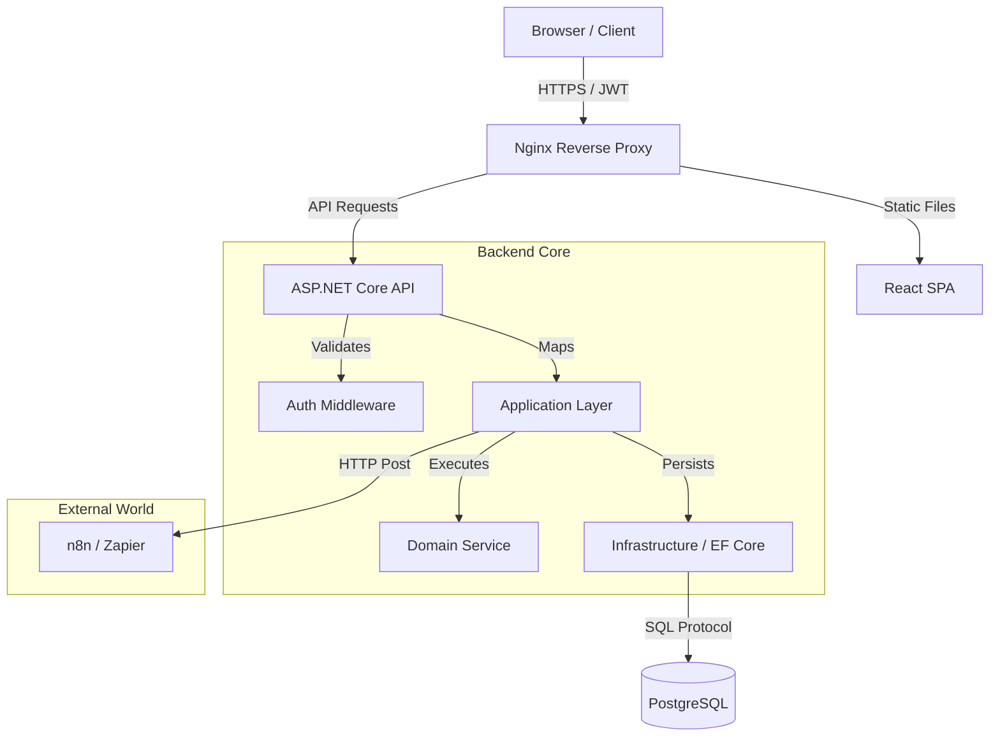
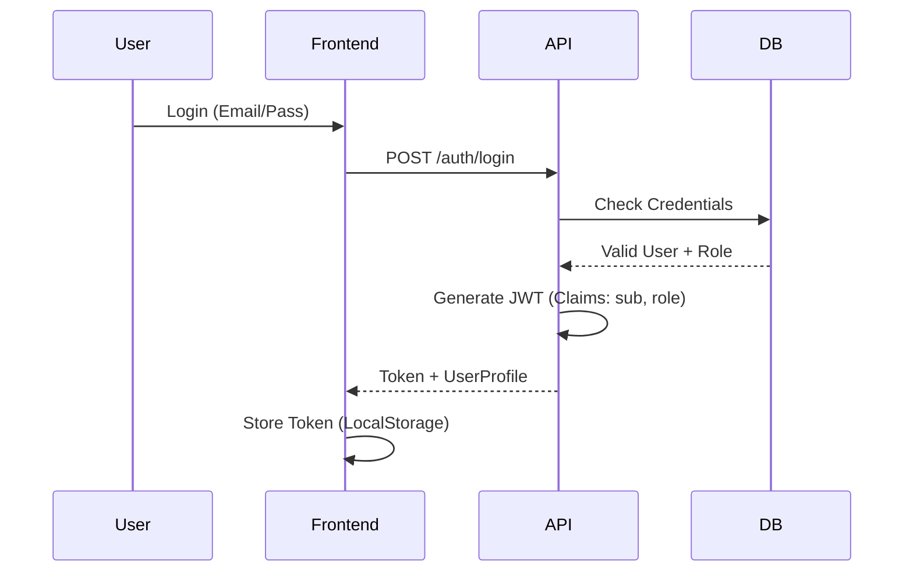
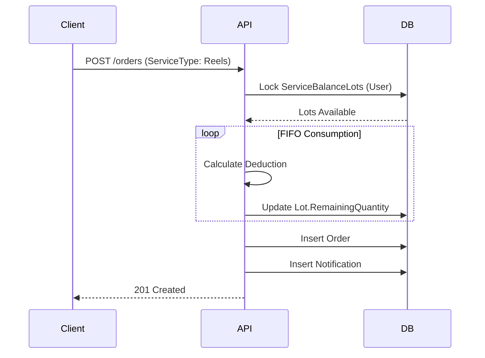

# Media 8 - Arquitetura do Sistema

> **Visão Técnica**: Este documento detalha as decisões de design, padrões e fluxos de dados que compõem a plataforma Media 8.
> 
> **Última Atualização**: 20/05/2026 - Épico 3 concluído: Refatoração completa de domínio (Packages → Offers/ClientContracts) e purga do legado.

---

## Sumário

1. [Visão Geral](#visão-geral)
2. [Stack Tecnológico](#stack-tecnológico)
3. [Padrões Arquiteturais (Design Patterns)](#padrões-arquiteturais-design-patterns)
4. [Fluxo de Dados](#fluxo-de-dados)
5. [Modelagem de Domínio](#modelagem-de-domínio)
6. [Integrações (Webhooks)](#integrações-webhooks)

---

## Visão Geral

A arquitetura segue o estilo **Monorepo** com separação estrita de responsabilidades (Clean Architecture no Backend, Feature-Based no Frontend).

### Marco da Fase 0 (Maio/2026)
O sistema passou por uma refatoração arquitetural completa para substituir enums estáticos (`ServiceType`) por entidades dinâmicas (`VideoFormat`). Isso permite que o catálogo de formatos de vídeo seja gerenciado via banco de dados, sem necessidade de deploy de código.

**Principais Mudanças:**
- ✅ Entidade `VideoFormat` com cache em memória (`IMemoryCache`)
- ✅ Relacionamentos N:N entre `Package` e `VideoFormat`
- ✅ Migration evolutiva preservando dados de usuários
- ✅ Endpoint público `/api/v1/video-formats` para consumo do frontend

---

## Stack Tecnológico

### Frontend (`media8-web`)
Focado em **Performance** e **UX Premium**.
* **Core**: React 18, TypeScript, Vite.
* **State**: TanStack Query (Gerenciamento de Cache Server-Side).
* **UI System**: Tailwind CSS + shadcn/ui.
* **Performance**: Virtualização de listas (`InfiniteScroll`) e Debounce em buscas.
* **Data-Driven Architecture**: Catálogo dinâmico de `VideoFormat` consumido via `useVideoFormats` hook com `staleTime: 5min`.

### Backend (`media8-api`)
Focado em **Segurança** e **Integridade de Dados**.
*   **Runtime**: .NET 10 (Preview) / C# 13.
*   **Architecture**: Clean Architecture (Api -> Application -> Domain -> Infrastructure).
*   **Data**: Entity Framework Core com migrações gerenciadas.

### Database
*   **Engine**: PostgreSQL (Dockerizado no `media8-infra`).
*   **Features**: Triggers nativos para audit trail e consistência.

---

## Padrões Arquiteturais (Design Patterns)

### 1. Snapshot Pattern (Immutabilidade)
**Problema**: Se alterarmos o preço de um pacote no catálogo hoje, como garantir que o cliente que comprou ontem não tenha seu contrato alterado?
**Solução**: Implementamos o padrão **Snapshot** na entidade `PackageAssignment`. Ao criar um contrato, copiamos os dados vitais (Nome, Preço, Validade) para dentro da atribuição. O catálogo pode mudar, mas o contrato é imutável.
*   *Implementação*: Ver `docs/implementations/016-arquitetura-snapshot-contratos.md`.

### 2. DTO Pattern (Data Transfer Objects)
**Problema**: Circular References e Over-posting de dados sensíveis (`PasswordHash`, `InternalFlags`).
**Solução**: A API nunca retorna Entidades de Domínio diretamente. Todo dado é mapeado para um DTO específico de resposta.
*   **Segurança**: Campos como `Balance` são calculados no mapeamento, impedindo que o cliente manipule lógica de negócio.

### 3. Service Balance & FIFO Strategy
**Problema**: Clientes acumulam créditos de diferentes compras com validades diferentes.
**Solução**: O sistema utiliza uma tabela de Lotes (`ServiceBalanceLots`). Ao consumir um serviço, o algoritmo consome automaticamente do lote mais antigo para o mais novo (**First-In, First-Out**), otimizando o uso dos créditos do cliente antes que expirem.

### 4. Data-Driven Catalog (VideoFormat Entity)
**Problema**: Enums estáticos (`ServiceType`) exigiam deploy de código para adicionar novos formatos de vídeo, limitando a agilidade do time de produto.
**Solução**: Migração para entidade dinâmica `VideoFormat` com cache em memória (`IMemoryCache`) no backend e hook dedicado (`useVideoFormats`) no frontend. O catálogo é agora gerenciável via banco de dados.
* **Frontend**: Componentes iteram sobre `videoFormats.data` (TanStack Query) ao invés de arrays hardcodados.
* **Backend**: `VideoFormatsController` expõe endpoint `GET /api/v1/video-formats` com projeção otimizada.
* **Impacto**: Novos formatos surgem na UI de pedidos instantaneamente, sem necessidade de deploy.
* *Implementação*: Ver `docs/implementations/030-frontend-data-driven-migracao.md`.

### 5. Domain Refactoring (Offers & ClientContracts) - Épico 3
**Problema**: A entidade `Package` representava simultaneamente o produto comercial e o direito adquirido, gerando ambiguidade e limitando flexibilidade. O admin não conseguia definir regras dinâmicas de validade, fidelidade e entrega por oferta.
**Solução**: Separação em duas entidades distintas:
- **Offer**: Produto comercial com `ContractType`, `ValidityDays`, `LoyaltyMonths`, `DeliveryDays`.
- **ClientContract**: Contrato imutável com snapshot dos dados no momento da contratação.
* **Dual-Run Migration**: Criação paralela das novas entidades coexistindo com legado, seguida de purga completa.
* **PascalCase Standard**: Schema de banco 100% PascalCase, eliminando ambiguidades snake_case.
* **Impacto**: Admins criam ofertas com regras dinâmicas sem deploy; histórico de clientes protegido via Snapshot.
* *Implementação*: Ver `docs/implementations/034-refatoracao-dominio-offers-clientcontracts.md`.

### 6. Integration Testing Suite - Épico 3.5
**Problema**: Após a refatoração de domínio, era necessário garantir blindagem contra regressões sem depender de testes manuais via Postman/Swagger.
**Solução**: Criação da projeto `Media8.IntegrationTests` usando `WebApplicationFactory` com seed automático de banco em memória.
* **CustomWebApplicationFactory**: Injeta o `DbSeeder` automaticamente, populando usuários padrão e configurações.
* **Credenciais Reais**: Uso de `admin@admin.com` / `SenhaAdmin` e enums em português (`Assinatura`, `Pacote`).
* **IDs Previsíveis + Slugs Únicos**: Combinação de GUIDs fixos para usuários e dinâmicos para evitar conflitos.
* **Cobertura**: 10 testes automatizados validando Auth, RBAC, Criação de Ofertas e Contração com Snapshot.
* *Implementação*: Ver `docs/implementations/035-testes-integracao-blindagem-backend.md`.

### 7. Frontend Unit Testing - Épico 3.7
**Problema**: Com a migração do frontend para `Offers/ClientContracts`, era crítico garantir que services e hooks funcionassem com precisão sem depender de testes manuais na UI.
**Solução**: Implementação de suíte de testes unitários com Vitest, mockando Axios e TanStack Query.
* **Infraestrutura**: Vitest + jsdom + Testing Library React
* **Services**: 12 testes validando chamadas HTTP, payloads e URLs para `/offers` e `/client-contracts`
* **Hooks**: 9 testes validando ciclo de vida, invalidação de cache e toasts do TanStack Query
* **Cobertura**: 21 testes passando, garantindo 100% da engine de dados do frontend
* *Implementação*: Ver `docs/implementations/037-testes-unitarios-frontend.md`.

### 8. UI Contract Management - Épico 3.9
**Problema**: A página de usuários estava quebrada após remoção de hooks legados (`useAssignPackage`), e a gaveta de detalhes não exibia contratos dos clientes.
**Solução**: Criação de componente `ContractAssignDialog` isolado e atualização do `UserDetailsSheet` para exibir contratos em tempo real.
* **ContractAssignDialog**: Modal reutilizável com select de ofertas, validação e mutation
* **UserDetailsSheet**: Exibição de "Contratos Ativos" com snapshot (nome, preço, vídeos, status, validade)
* **Data Flow**: `useClientContracts(user.id)` buscando dados reais do banco
* **UX**: Estados de loading, empty state, badges coloridos por status
* *Implementação*: Ver `docs/implementations/039-integracao-completa-vinculo-contratos-usuarios.md`.

### 9. Conditional Deletion Pattern - Épico 4.0
**Problema**: Entidades como Ofertas, Formatos e Estilos eram apenas desativadas (Soft Delete), acumulando "lixo" no banco, mas excluí-las fisicamente poderia quebrar integridade relacional se houvessem dependências.
**Solução**: Implementado padrão de **Deleção Condicional** com verificação de dependências e UI com abas "Ativos/Arquivados".
* **Backend**: Verifica `ClientContracts` e `ServiceBalanceLots` antes de deletar. Sem dependências = Hard Delete; Com dependências = Soft Delete (arquivamento).
* **Frontend**: Timer visual de 5 segundos com barra de progresso para exclusões destrutivas, prevenindo cliques acidentais.
* **DTO Shadowing Bug**: Durante implementação, classe DTO duplicada no controller causou erro CS0117. Solução: Remover declaração local e usar DTOs de `Media8.Application.DTOs.Services`.
* **Impacto**: Banco limpo de registros órfãos, integridade preservada, UX com feedback claro.
* *Implementação*: Ver `docs/implementations/048-abas-arquivamento-delecao-condicional-ofertas.md` e `docs/implementations/050-correcao-dto-duplicado-videoformats.md`.

### 10. UI Consistency Pattern - Épico 4.1
**Problema**: Após implementação do padrão de abas e timer em Ofertas, as páginas de Formatos e Estilos ainda usavam UI legada sem segregação de ativos/arquivados.
**Solução**: Replicação do mesmo padrão de UX em todas as telas de catálogo do admin.
* **VideoFormatsPage**: Abas Ativos/Arquivados, timer de 5s, reativação, verificação `canDeletePermanently`.
* **EditingStylesPage**: Mesma arquitetura de formatos, com validação de dependências em Offers.
* **Componentes Reutilizados**: `Tabs`, `Dialog`, `DropdownMenu` do shadcn/ui.
* **Impacto**: UX consistente em todo admin, redução de curva de aprendizado, código mais manutenível.
* *Implementação*: Ver `docs/implementations/051-unificacao-padrao-abas-timer-formatos-estilos.md`.

### 11. User Governance Pipeline - Épico 4.2
**Problema**: Gestão de usuários exigia segregação entre ativos/inativos com reativação sem reload, mas a API não expunha `IsActive` e o frontend usava `window.location.reload()`.
**Solução**: Pipeline completo comDTO `IsActive`, filtro repositório `showInactive`, invalidação de cache e centralização de estado.
* **Backend**: Adicionado `IsActive` no `AdminUserDto`, filtro `.Where(u => u.IsActive == !showInactive)`, endpoint `PUT /users/{id}/reactivate`.
* **Frontend**: Service repassa `showInactive`, `queryClient.invalidateQueries()` substitui reload, `e.stopPropagation()` previne event bubbling.
* **Correções**: Eliminado Temporal Dead Zone, removido AlertDialog duplicado, centralizado estado na UsersPage.
* **Impacto**: UX fluida sem reload, modal abre 1 única vez, lista de inativos carrega corretamente.
* *Implementação*: Ver `docs/implementations/052-pipeline-estrito-ciclo-vida-dados.md`, `docs/implementations/053-governanca-estrita-usuarios-arquivamento-reativacao.md`, `docs/implementations/054-correcao-completa-governanca-usuarios.md`.

### 12. Dynamic Settings System - Épico 4.3
**Problema**: Regras de negócio críticas (ex: janela de cancelamento de pedidos) estavam hardcoded, exigindo deploy para alterações e sem transparência para admins.
**Solução**: Sistema de configurações dinâmicas com entidade `SystemSetting`, cache Singleton com `IServiceScopeFactory` para persistência, API admin protegida por RBAC, e UI de gestão.
* **Backend**: `SystemSetting` entity, `SettingsService` com `ConcurrentDictionary`, `AdminSettingsController` (GET/PATCH), integração com `OrderService` para validação dinâmica.
* **Frontend**: `AdminSettingsSection` na SettingsPage, hook `useQuery` para busca assíncrona, tratamento de loading e erro.
* **Segurança**: Apenas Admins podem alterar configurações, cache e banco sincronizados, fallback para valor padrão se falhar.
* **Impacto**: Admins alteram regras sem deploy, performance O(1) com cache, consistência entre frontend/backend.
* *Implementação*: Ver `docs/implementations/058-configuracoes-dinamicas-sistema-completo.md`.

### 13. Order Cancellation UX - Épico 4.4
**Problema**: Cancelamento de pedidos lacked feedback visual, confirmação, e tratamento semântico de erros (400 ao invés de 422), criando experiência frustrante.
**Solução**: Fluxo completo com `BusinessRuleException` (422), componente `CancelOrderButton` com timer regressivo, modal de confirmação, e sincronização com configurações dinâmicas.
* **Backend**: `BusinessRuleException` com `ErrorCode`, middleware global para 422, `OrderService` com validação dinâmica de janela.
* **Frontend**: `CancelOrderButton` com máquina de estados (vigente, expirado, confirmação), tratamento de erro 422 com toast específico, busca dinâmica de `cancellationWindowHours`.
* **UX**: Timer em tempo real, confirmação educada com resumo de estorno, mensagens claras para cada cenário (prazo expirado, já cancelado, etc.).
* **Impacto**: Experiência educada e transparente, consistência entre páginas, admins podem ajustar janela de cancelamento dinamicamente.
* *Implementação*: Ver `docs/implementations/059-ux-cancelamento-pedidos-com-timer-e-validacao.md`.

---

## Fluxo de Dados

### Autenticação (JWT + RBAC)

### Consumo de Serviço (Criação de Pedido)

---

## Modelagem de Domínio

Principais Agregados do sistema:

### Agregado de Autenticação
*   `User` (Root)
*   `UserRole` (Value Object)
*   `Profile` (Entity)

### Agregado de Vendas
*   `Package` (Catálogo)
*   `PackageAssignment` (Contrato) -> **Comportamento Snapshot**
    *   `SnapshotPackageName`
    *   `SnapshotValidityDays`
*   `ServiceBalanceLot` (Inventário)

### Agregado de Produção
*   `Order` (Root)
*   `OrderTimeline` (Log de eventos)

---

## Integrações (Webhooks)

O sistema "Media 8" atua como produtor de eventos para o ecossistema de marketing digital.

### Estratégia "Fire-and-Forget"
Eventos chaves (Venda, Pedido Criado, Status Alterado) disparam notificações HTTP para serviços como **n8n** ou **Zapier**.
Isso permite que automações de Email Marketing e CRM sejam desacopladas do core da aplicação.

> **Configuração**: Variável `WEBHOOK_NOTIFICATION_URL` no `.env`.

---
**Nota:** Para detalhes profundos de implementação de cada módulo, consulte a pasta `docs/implementations`.
