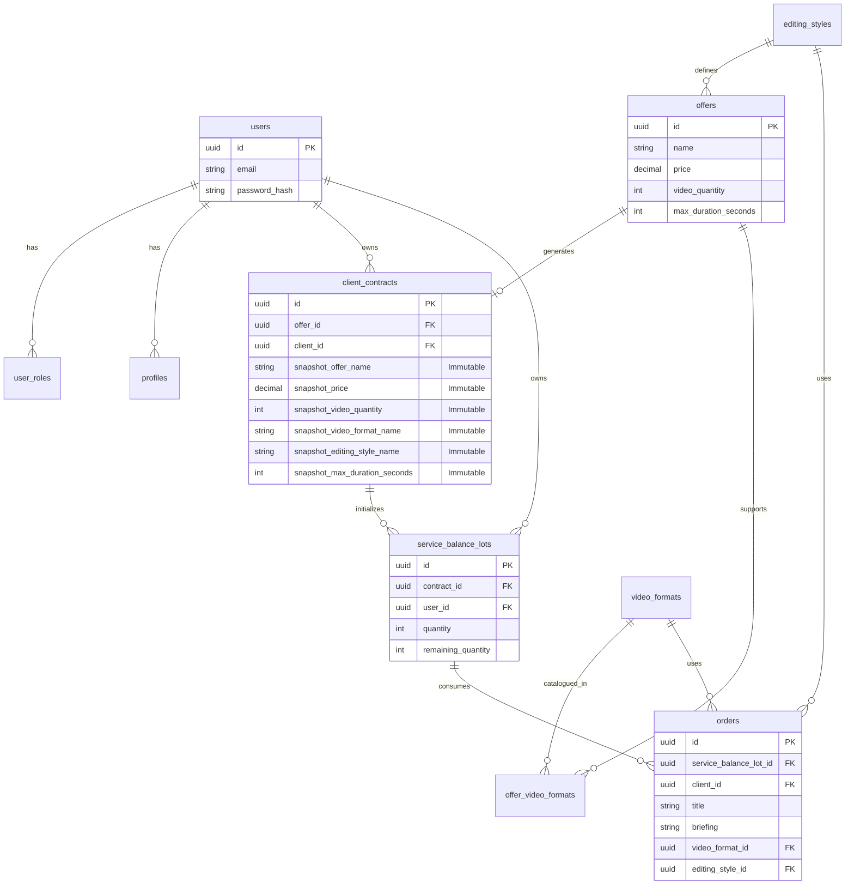

# Media 8 - Esquema de Banco de Dados

> **Documento Vivo**: Este esquema reflete a estrutura atual do banco de dados PostgreSQL, incluindo decisões de **Imutabilidade** e **Granularidade**.
>
> **Última Atualização**: 20/05/2026 - Schema consolidado após refatoração Épico 3 (Offers/ClientContracts) e purga do legado Packages.

---

## Sumário

1. [Visão Geral](#visão-geral)
2. [Diagrama ER](#diagrama-er)
3. [Enums & Tipos](#enums--tipos)
4. [Tabelas Core](#tabelas-core)
5. [Performance (Índices)](#performance-índices)
6. [Automação (Triggers)](#automação-triggers)

---

## Visão Geral

A arquitetura de dados do Media 8 foi desenhada para suportar alto volume de transações e integridade contratual.

### Marco da Fase 0 (Maio/2026)
O banco de dados passou por uma migração evolutiva que:
- ✅ Removeu o enum `service_type` do PostgreSQL
- ✅ Adicionou tabela `video_formats` para catálogo dinâmico
- ✅ Adicionou tabela de junção `package_video_formats` (N:N)
- ✅ Migrou colunas `ServiceType` para `VideoFormatId` (Guid) em `Orders` e `ServiceBalanceLots`
- ✅ Preservou todos os dados de usuários (técnica de TRUNCATE seletivo)

### Princípios Fundamentais
* **Imutabilidade de Contratos (Snapshot Pattern)**: Quando um contrato é criado, seus dados vitais (Nome, Preço, Quantidade, Validade, Formato de Vídeo, Estilo de Edição) são copiados como **valores primitivos** (texto/número) para dentro do `ClientContract`. Isso garante que alterações futuras em `Offers`, `VideoFormats` ou `EditingStyles` não "reescrevam a história" de contratos antigos.
* **Separação Offer/Contract**: `Offers` (produto comercial) é distinto de `ClientContracts` (direito adquirido), permitindo evolução independente do catálogo e dos contratos.
* **Lote de Saldo como Carteira Numérica**: `ServiceBalanceLot` conhece apenas seu `ContractId` e quantidades (`Quantity`, `RemainingQuantity`). **Não possui FKs para `VideoFormat` ou `EditingStyle`**. Toda validação técnica do pedido é extraída do snapshot do contrato pai.
* **Catálogo Data-Driven**: Formatos de vídeo e estilos de edição são entidades gerenciáveis em banco, não enums em código.
* **Granularidade Temporal**: Durações são armazenadas em **segundos** para suportar a natureza de *Short Form Content* (Reels/TikToks).
* **Consumo FIFO**: Lotes de serviços (`service_balance_lots`) são consumidos do mais antigo para o mais novo, prevenindo expiração prematura de créditos novos.
* **Segurança (RBAC)**: Segregação estrita de roles e triggers automáticos para higiene de dados.
* **Padrão PascalCase**: Todas as tabelas e colunas seguem nomenclatura PascalCase consistente, eliminando ambiguidades snake_case.
* **Testabilidade**: Schema projetado para suportar testes E2E com seed automático de dados padrão (usuários, formatos, estilos).
* **Frontend-Backend Sync**: Estrutura de banco reflete exatamente os DTOs do frontend, garantindo tipagem ponta-a-ponta.

---

## Diagrama ER



---

## Enums & Tipos

O uso de ENUMs do PostgreSQL garante integridade de domínio diretamente no banco.

### Enums Ativos (Pós-Fase 0)

```sql
-- Roles: Implementação de RBAC
CREATE TYPE public.app_role AS ENUM ('admin', 'editor', 'client');

-- Categorias de Venda
CREATE TYPE public.package_category AS ENUM ('assinatura', 'pacote', 'avulso');

-- Fontes de Saldo
CREATE TYPE public.lot_source AS ENUM ('purchase', 'subscription', 'promo', 'gift');

-- Complexidade de Formatos (adicionado na Fase 0)
CREATE TYPE public.complexity_level AS ENUM ('standard', 'premium', 'god_mode');
```

### Enums Removidos (Pré-Fase 0)

O enum `service_type` foi **removido** e substituído pela tabela dinâmica `video_formats`. Isso permite que admins criem novos formatos sem alterar o código.

```sql
-- REMOVIDO NA MIGRATION 20260519170248_MigrateServiceTypeToVideoFormat
-- DROP TYPE public.service_type;
-- Antigo: 'reels_standard', 'reels_premium', 'youtube_curto', etc.
```

---

## Tabelas Core

### 1. `users` & `profiles`
Separação entre Credenciais (Auth) e Dados Pessoais.

```sql
CREATE TABLE public.users (
  id UUID PRIMARY KEY DEFAULT gen_random_uuid(),
  email VARCHAR(255) NOT NULL UNIQUE,
  password_hash VARCHAR(255) NOT NULL,
  created_at TIMESTAMPTZ NOT NULL DEFAULT NOW(),
  updated_at TIMESTAMPTZ NOT NULL DEFAULT NOW()
);

CREATE TABLE public.profiles (
  id UUID PRIMARY KEY DEFAULT gen_random_uuid(),
  user_id UUID NOT NULL REFERENCES public.users(id) ON DELETE CASCADE,
  name VARCHAR(255) NOT NULL,
  phone VARCHAR(20),
  avatar_url TEXT,
  -- ...
);
```

### 2. `packages` (Catálogo)
Define os produtos vendáveis. Note o uso de `max_duration_seconds`.

```sql
CREATE TABLE public.packages (
  id UUID PRIMARY KEY DEFAULT gen_random_uuid(),
  name VARCHAR(255) NOT NULL,
  category package_category NOT NULL,
  price DECIMAL(10, 2) NOT NULL CHECK (price >= 0),
  video_quantity INTEGER NOT NULL CHECK (video_quantity > 0),
  
  -- Refatorado de minutes -> seconds para suportar Shorts
  max_duration_seconds INTEGER NOT NULL CHECK (max_duration_seconds > 0),
  
  validity_days INTEGER, -- NULL = Assinatura Recorrente
  is_active BOOLEAN NOT NULL DEFAULT true,
  created_at TIMESTAMPTZ NOT NULL DEFAULT NOW()
);
```

### 3. `client_contracts` (Contratos - Snapshot Pattern)
**Destaque Arquitetural:** Implementação de Snapshot Completo.

```sql
CREATE TABLE public.client_contracts (
id UUID PRIMARY KEY DEFAULT gen_random_uuid(),

-- Relacionamentos (apenas para rastreabilidade)
offer_id UUID NOT NULL REFERENCES public.offers(id),
client_id UUID NOT NULL REFERENCES public.users(id),
assigned_by_id UUID REFERENCES public.users(id),

-- Snapshot Comercial (Imutável)
snapshot_offer_name VARCHAR(255) NOT NULL,
snapshot_price DECIMAL(10,2) NOT NULL,
snapshot_video_quantity INTEGER NOT NULL,
snapshot_validity_days INTEGER,
snapshot_delivery_days INTEGER,
snapshot_warranty_days INTEGER,

-- Snapshot Técnico (Imutável - Sem FKs)
-- Copia o NOME do formato, não o ID. Se o formato mudar, o contrato permanece intacto.
snapshot_video_format_name VARCHAR(100) NOT NULL,
snapshot_editing_style_name VARCHAR(100) NOT NULL,
snapshot_max_duration_seconds INTEGER NOT NULL,

status assignment_status NOT NULL DEFAULT 'active',
created_at TIMESTAMPTZ NOT NULL DEFAULT NOW()
);
```

**Regra de Ouro:** `ClientContract` **NÃO** possui chaves estrangeiras para `video_formats` ou `editing_styles`. Todos os dados técnicos são copiados como texto/número puro no momento da assinatura.

### 3.5. `video_formats` (Catálogo Dinâmico) [NOVO - Fase 0]

Substitui o enum estático `service_type`. Permite que admins cadastrem formatos via banco.

```sql
CREATE TABLE public.video_formats (
id UUID PRIMARY KEY DEFAULT gen_random_uuid(),
name VARCHAR(100) NOT NULL,
slug VARCHAR(100) NOT NULL UNIQUE, -- Ex: "reels-premium"
max_duration_seconds INTEGER NOT NULL,
tier complexity_level NOT NULL, -- standard, premium, god_mode
is_active BOOLEAN NOT NULL DEFAULT true,
created_at TIMESTAMPTZ NOT NULL DEFAULT NOW(),
updated_at TIMESTAMPTZ NOT NULL DEFAULT NOW()
);

-- Índice para busca por slug
CREATE INDEX idx_video_formats_slug ON public.video_formats(slug);
```

### 4. `service_balance_lots` (Carteira - Controle Numérico)
Gerencia o saldo consumível do usuário com lógica FIFO.

**Princípio Arquitetural:** Esta tabela é **estritamente numérica**. Não possui FKs para `video_formats` ou `editing_styles`.

```sql
CREATE TABLE public.service_balance_lots (
id UUID PRIMARY KEY DEFAULT gen_random_uuid(),

-- Relacionamentos (única FK é com o contrato)
contract_id UUID NOT NULL REFERENCES public.client_contracts(id),
user_id UUID NOT NULL REFERENCES public.users(id),

-- Controle Numérico
quantity INTEGER NOT NULL,
remaining_quantity INTEGER NOT NULL, -- Decrementado a cada uso

-- Expiração e Origem
expires_at TIMESTAMPTZ,
source lot_source NOT NULL DEFAULT 'purchase'
);

-- Índice para consumo FIFO (por contract_id, user_id)
CREATE INDEX idx_service_lots_fifo ON public.service_balance_lots(user_id, contract_id, expires_at ASC);
```

**Regra de Ouro:** O lote de saldo **não conhece** formatos ou estilos. Para validar um pedido, o sistema:
1. Lê o `contract_id` do lote
2. Busca o `client_contract` pai
3. Extrai os snapshots (`snapshot_video_format_name`, `snapshot_editing_style_name`, etc.)
4. Valida o pedido contra os dados imutáveis do contrato

### 5. `orders` (Pedidos - Vínculo com Saldo)
Transacional de produção de vídeos.

**Vínculo com Saldo:** O pedido nasce do consumo de um `service_balance_lot`, que por sua vez está vinculado a um `client_contract`.

```sql
CREATE TABLE public.orders (
id UUID PRIMARY KEY DEFAULT gen_random_uuid(),

-- Vínculo com Saldo (origem do crédito)
service_balance_lot_id UUID REFERENCES public.service_balance_lots(id),

-- Cliente e Editor
client_id UUID NOT NULL REFERENCES public.users(id),
editor_id UUID REFERENCES public.users(id),

-- Dados do Pedido
title VARCHAR(255) NOT NULL,
briefing TEXT NOT NULL,
source_files_url TEXT,
final_video_url TEXT,

-- Formato Técnico (herdado do contrato via saldo)
-- O frontend valida contra o snapshot do contrato antes de criar
video_format_id UUID NOT NULL REFERENCES public.video_formats(id),
editing_style_id UUID REFERENCES public.editing_styles(id),

status order_status NOT NULL DEFAULT 'pending',
deadline DATE NOT NULL,
created_at TIMESTAMPTZ NOT NULL DEFAULT NOW()
);
```

**Fluxo de Validação:**
1. Cliente seleciona `service_balance_lot` no formulário
2. Frontend busca `client_contract` vinculado ao lote
3. Frontend lê snapshots (`snapshot_video_format_name`, etc.)
4. Sistema valida se pedido corresponde ao snapshot
5. Se válido, decrementa `remaining_quantity` do lote e cria pedido

### 6. `offers` (Catálogo Comercial - Substitui `packages`)
Define os produtos vendáveis com modelo de assinatura ou pacotes avulsos.

```sql
CREATE TABLE public.offers (
id UUID PRIMARY KEY DEFAULT gen_random_uuid(),

-- Dados Comerciais
name VARCHAR(255) NOT NULL,
category package_category NOT NULL,
price DECIMAL(10, 2) NOT NULL CHECK (price >= 0),
video_quantity INTEGER NOT NULL CHECK (video_quantity > 0),
max_duration_seconds INTEGER NOT NULL,
validity_days INTEGER, -- NULL = Assinatura Recorrente
is_active BOOLEAN NOT NULL DEFAULT true,
created_at TIMESTAMPTZ NOT NULL DEFAULT NOW()
);
```

### 7. `offer_video_formats` (Junção N:N - Catálogo)
Relaciona ofertas com múltiplos formatos de vídeo (apenas no catálogo).

```sql
CREATE TABLE public.offer_video_formats (
offer_id UUID NOT NULL REFERENCES public.offers(id) ON DELETE CASCADE,
video_format_id UUID NOT NULL REFERENCES public.video_formats(id) ON DELETE CASCADE,
PRIMARY KEY (offer_id, video_format_id)
);

CREATE INDEX idx_offer_video_formats_format ON public.offer_video_formats(video_format_id);
```

**Nota:** Esta tabela de junção existe **apenas no catálogo**. Contratos (`client_contracts`) não usam esta tabela — eles armazenam snapshots de texto puro.

---

## Performance (Índices)

Índices estratégicos para suportar as queries mais pesadas do sistema.

| Tabela | Índice | Justificativa |
|--------|--------|---------------|
| `users` | `idx_users_email` | Login ultra-rápido (Unique Scan) |
| `service_balance_lots` | `idx_service_lots_fifo` | Query complexa de consumo (`ORDER BY expires_at, purchased_at`) |
| `package_assignments` | `idx_assignments_client_status` | Dashboard do Cliente ("Meus Planos Ativos") |
| `packages` | `idx_packages_active` | Listagem de Catálogo (Filtro `IsActive=true`) |

---

## Automação (Triggers)

### 1. `handle_new_user`
Gatilho de "Boas Vindas" que roda após insert em `users`.
*   Cria automaticamente o `profile` vazio.
*   Atribui a role padrão `client`.

### 2. `update_updated_at`
G garante que a coluna `updated_at` seja sempre fidedigna à última modificação real do registro, sem depender da aplicação.

---
**Nota:** Para detalhes sobre como o código interage com este schema, consulte a documentação da API em `media8-api/README.md`.
