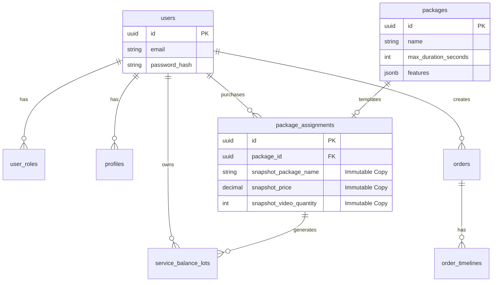

# Media 8 - Esquema de Banco de Dados

> **Documento Vivo**: Este esquema reflete a estrutura atual do banco de dados PostgreSQL, incluindo decisões de **Imutabilidade** e **Granularidade**.

---

## Sumário

1. [Visão Geral](#visão-geral)
2. [Diagrama ER](#diagrama-er)
3. [Enums & Tipos](#enums--tipos)
4. [Tabelas Core](#tabelas-core)
5. [Performance (Índices)](#performance-índices)
6. [Automação (Triggers)](#automação-triggers)

---

## Visão Geral

A arquitetura de dados do Media 8 foi desenhada para suportar alto volume de transações e integridade contratual.

### Princípios Fundamentais
*   **Imutabilidade de Contratos (Snapshot Pattern)**: Quando um pacote é atribuído, seus dados vitais (Nome, Preço, Quantidade) são copiados para a tabela `package_assignments`. Isso garante que alterações futuras no catálogo (`packages`) não "reescrevam a história" de contratos antigos.
*   **Granularidade Temporal**: Durações são armazenadas em **segundos** para suportar a natureza de *Short Form Content* (Reels/TikToks).
*   **Consumo FIFO**: Lotes de serviços (`service_balance_lots`) são consumidos do mais antigo para o mais novo, prevenindo expiração prematura de créditos novos.
*   **Segurança (RBAC)**: Segregação estrita de roles e triggers automáticos para higiene de dados.

---

## Diagrama ER



---

## Enums & Tipos

O uso de ENUMs do PostgreSQL garante integridade de domínio diretamente no banco.

```sql
-- Roles: Implementação de RBAC
CREATE TYPE public.app_role AS ENUM ('admin', 'editor', 'client');

-- Categorias de Venda
CREATE TYPE public.package_category AS ENUM ('assinatura', 'pacote', 'avulso');

-- Serviços (Unidade de Trabalho)
CREATE TYPE public.service_type AS ENUM (
  'reels_standard', 'reels_premium', 
  'youtube_curto', 'youtube_medio', 'youtube_longo',
  'pacote_reels', 'avulso'
);

-- Fontes de Saldo
CREATE TYPE public.lot_source AS ENUM ('purchase', 'subscription', 'promo', 'gift');
```

---

## Tabelas Core

### 1. `users` & `profiles`
Separação entre Credenciais (Auth) e Dados Pessoais.

```sql
CREATE TABLE public.users (
  id UUID PRIMARY KEY DEFAULT gen_random_uuid(),
  email VARCHAR(255) NOT NULL UNIQUE,
  password_hash VARCHAR(255) NOT NULL,
  created_at TIMESTAMPTZ NOT NULL DEFAULT NOW(),
  updated_at TIMESTAMPTZ NOT NULL DEFAULT NOW()
);

CREATE TABLE public.profiles (
  id UUID PRIMARY KEY DEFAULT gen_random_uuid(),
  user_id UUID NOT NULL REFERENCES public.users(id) ON DELETE CASCADE,
  name VARCHAR(255) NOT NULL,
  phone VARCHAR(20),
  avatar_url TEXT,
  -- ...
);
```

### 2. `packages` (Catálogo)
Define os produtos vendáveis. Note o uso de `max_duration_seconds`.

```sql
CREATE TABLE public.packages (
  id UUID PRIMARY KEY DEFAULT gen_random_uuid(),
  name VARCHAR(255) NOT NULL,
  category package_category NOT NULL,
  price DECIMAL(10, 2) NOT NULL CHECK (price >= 0),
  video_quantity INTEGER NOT NULL CHECK (video_quantity > 0),
  
  -- Refatorado de minutes -> seconds para suportar Shorts
  max_duration_seconds INTEGER NOT NULL CHECK (max_duration_seconds > 0),
  
  validity_days INTEGER, -- NULL = Assinatura Recorrente
  is_active BOOLEAN NOT NULL DEFAULT true,
  created_at TIMESTAMPTZ NOT NULL DEFAULT NOW()
);
```

### 3. `package_assignments` (Contratos)
**Destaque Arquitetural:** Implementação de Snapshots.

```sql
CREATE TABLE public.package_assignments (
  id UUID PRIMARY KEY DEFAULT gen_random_uuid(),
  
  -- Relacionamentos
  package_id UUID NOT NULL REFERENCES public.packages(id),
  client_id UUID NOT NULL REFERENCES public.users(id),
  
  -- Colunas de Snapshot (Imutabilidade)
  -- Armazenam o estado do pacote NO MOMENTO da compra
  snapshot_package_name VARCHAR(255),
  snapshot_price DECIMAL(10,2),
  snapshot_video_quantity INTEGER,
  snapshot_validity_days INTEGER,

  status assignment_status NOT NULL DEFAULT 'active',
  created_at TIMESTAMPTZ NOT NULL DEFAULT NOW()
);
```

### 4. `service_balance_lots` (Carteira)
Gerencia o saldo consumível do usuário com lógica FIFO.

```sql
CREATE TABLE public.service_balance_lots (
  id UUID PRIMARY KEY DEFAULT gen_random_uuid(),
  user_id UUID NOT NULL REFERENCES public.users(id),
  
  service_type service_type NOT NULL,
  quantity INTEGER NOT NULL,
  remaining_quantity INTEGER NOT NULL, -- Decrementado a cada uso
  
  expires_at TIMESTAMPTZ,
  source lot_source NOT NULL DEFAULT 'purchase'
);
```

### 5. `orders` (Pedidos)
Transacional de produção de vídeos.

```sql
CREATE TABLE public.orders (
  id UUID PRIMARY KEY DEFAULT gen_random_uuid(),
  client_id UUID NOT NULL REFERENCES public.users(id),
  editor_id UUID REFERENCES public.users(id),
  
  title VARCHAR(255) NOT NULL,
  briefing TEXT NOT NULL,
  source_files_url TEXT,
  final_video_url TEXT,
  
  status order_status NOT NULL DEFAULT 'pending',
  deadline DATE NOT NULL
);
```

---

## Performance (Índices)

Índices estratégicos para suportar as queries mais pesadas do sistema.

| Tabela | Índice | Justificativa |
|--------|--------|---------------|
| `users` | `idx_users_email` | Login ultra-rápido (Unique Scan) |
| `service_balance_lots` | `idx_service_lots_fifo` | Query complexa de consumo (`ORDER BY expires_at, purchased_at`) |
| `package_assignments` | `idx_assignments_client_status` | Dashboard do Cliente ("Meus Planos Ativos") |
| `packages` | `idx_packages_active` | Listagem de Catálogo (Filtro `IsActive=true`) |

---

## Automação (Triggers)

### 1. `handle_new_user`
Gatilho de "Boas Vindas" que roda após insert em `users`.
*   Cria automaticamente o `profile` vazio.
*   Atribui a role padrão `client`.

### 2. `update_updated_at`
G garante que a coluna `updated_at` seja sempre fidedigna à última modificação real do registro, sem depender da aplicação.

---
**Nota:** Para detalhes sobre como o código interage com este schema, consulte a documentação da API em `media8-api/README.md`.
