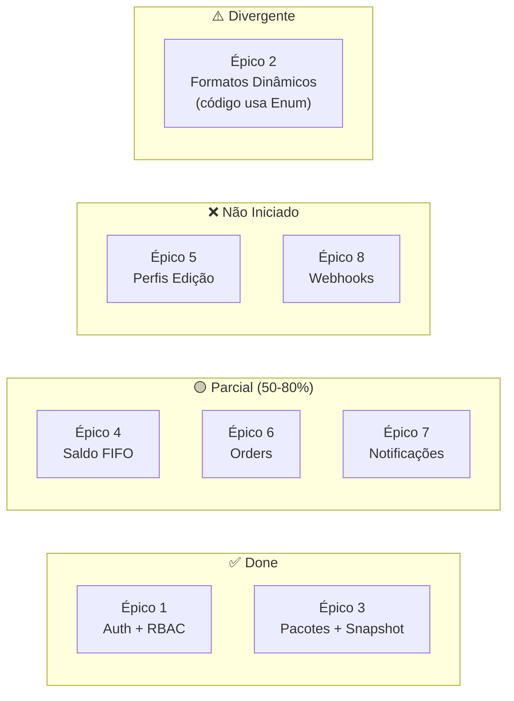

# 🔍 Análise do Backlog de User Stories — Media 8

> **Data:** 18/05/2026  
> **Arquivo analisado:** [media8_backlog_user_stories.md](file:///g:/DEV/Media8/media8-app-v1/docs/media8_backlog_user_stories.md)  
> **Cruzado com:** Código-fonte atual + 25 documentos de implementação + relatório anterior

---

## Veredito Geral

O backlog é **bem estruturado como guia de desenvolvimento**, mas apresenta **2 problemas estratégicos** e **vários desalinhamentos com o código atual** que precisam ser resolvidos antes de usá-lo como roadmap de execução.

---

## Análise Épico por Épico

### ✅ ÉPICO 1: Autenticação e Controle de Acesso — CORRETO

| User Story | Status no Código | Veredito |
|-----------|-----------------|----------|
| **US 1.1** — Login JWT | ✅ `AuthController.cs` com `POST /auth/login`, JWT com Claims de ID e Role | ✅ **Correto** |
| **US 1.2** — `/users/me` | ✅ Endpoint existe em `UsersController.cs` | ✅ **Correto** |
| **US 1.3** — Gestão Admin paginada + Debounce | ✅ `UsersController.cs` com `?search=&page=`, Debounce no frontend ([impl-011](file:///g:/DEV/Media8/media8-app-v1/docs/implementations/011-busca-server-side-otimizada.md)) | ✅ **Correto** |

> [!TIP]
> Este épico está 100% alinhado. Pode ser marcado como **Done** no backlog.

**Lacuna não documentada no backlog:** Não há US para `POST /auth/register` (Signup), mas a página `SignupPage.tsx` existe. Considere adicionar uma US 1.4 para cadastro.

---

### ⚠️ ÉPICO 2: Gestão Dinâmica de Formatos de Vídeo — **DIVERGE DO CÓDIGO ATUAL**

| User Story | Status no Código | Veredito |
|-----------|-----------------|----------|
| **US 2.1** — Tabela `video_formats` + `IMemoryCache` | ❌ **NÃO EXISTE**. O código usa `enum ServiceType` estático em [SharedEnums.cs](file:///g:/DEV/Media8/media8-app-v1/media8-api/Media8.Domain/Enums/SharedEnums.cs#L20-L29) | 🔴 **Divergente** |

> [!WARNING]
> **Problema crítico de alinhamento.** O backlog descreve uma arquitetura **Data-Driven** com tabela `video_formats` e cache em memória, mas o código implementa um **Enum estático** (`ReelsStandard`, `ReelsPremium`, `YoutubeCurto`, etc.). São abordagens fundamentalmente diferentes.

**Diagnóstico:** Esta US representa uma **evolução planejada** (migrar de enum para tabela dinâmica), mas não está marcada como tal no backlog. Quem ler vai achar que é o estado atual.

**Recomendação:** 
- Opção A: Marcar como **"Planejado — Refactoring"** e manter o enum por enquanto
- Opção B: Executar a migração antes de prosseguir (impacta `ServiceBalanceLot`, `Order`, `Package` — todas usam o enum)

---

### ✅ ÉPICO 3: Catálogo de Pacotes e Contratos — CORRETO

| User Story | Status no Código | Veredito |
|-----------|-----------------|----------|
| **US 3.1** — Criação de pacotes com formatos | ✅ `PackagesController.cs`, `Package.ServiceTypes` é `List<ServiceType>`, `IsPublic` existe | ✅ **Correto** |
| **US 3.2** — Landing Page / Catálogo público | ✅ `LandingPage.tsx` (28KB), `GET /packages` filtra ativos | ✅ **Correto** |
| **US 3.3** — Snapshot Pattern na atribuição | ✅ `PackageAssignment` tem `SnapshotPackageName`, `SnapshotPrice`, `SnapshotVideoQuantity`, `SnapshotValidityDays` | ✅ **Correto** |

> [!TIP]
> Épico bem documentado e alinhado com a implementação. Os critérios de aceite são verificáveis.

**Detalhe menor:** US 3.1 menciona "lista de IDs dos formatos de vídeo", mas no código atual são enums (`List<ServiceType>`), não IDs de tabela. Consistente com o Épico 2 estar no estado de enum.

---

### ✅ ÉPICO 4: Carteira de Créditos e Motor FIFO — CORRETO (com ressalva)

| User Story | Status no Código | Veredito |
|-----------|-----------------|----------|
| **US 4.1** — Geração automática de lotes | ✅ `ServiceBalanceLot` com `AssignmentId` FK, `Quantity`, `ExpiresAt` | ✅ **Correto** |
| **US 4.2** — Consulta de saldos | ✅ `GET /service-balances/my-balances` em `ServiceBalancesController.cs` com paginação | ✅ **Correto** |
| **US 4.3** — Abatimento FIFO | ✅ Documentado em [impl-001](file:///g:/DEV/Media8/media8-app-v1/docs/implementations/001-consumo-saldo-servicos.md) | 🟡 **Parcial** |

> [!IMPORTANT]
> **Ressalva sobre US 4.3:** Os critérios de aceite mencionam *Lock* na linha para evitar Race Conditions. Verificando o `ServiceBalancesController.cs`, **não há endpoint `POST /consume` visível** no controller atual. O endpoint de consumo pode estar embutido no fluxo de criação de ordem (dentro do `IOrderService.CreateAsync`), mas não é um endpoint público dedicado como a US descreve.

**Recomendação:** Verificar se o consumo está dentro de `OrderService.CreateAsync` ou se precisa ser exposto como endpoint separado conforme documentado na API Routes (`POST /service-balances/consume`).

---

### ❌ ÉPICO 5: Perfis de Edição — **NÃO IMPLEMENTADO**

| User Story | Status no Código | Veredito |
|-----------|-----------------|----------|
| **US 5.1** — CRUD de `editing_profiles` | ❌ Sem entity, sem controller, sem migration, sem tabela | 🔴 **Não existe** |
| **US 5.2** — Dropdown obrigatório na criação de pedido | ❌ `NewOrderPage.tsx` e `Order` entity não referenciam `EditingProfile` | 🔴 **Não existe** |

> [!CAUTION]
> Este é o maior gap entre o backlog e o código. O backlog trata como feature core, mas **zero implementação** existe. A entity `Order` no código não tem campo `EditingProfileId`.

**A US está correta e bem escrita** — os critérios de aceite são claros (CRUD, campos obrigatórios, dropdown com "+ Novo Perfil", bloqueio de submit sem perfil). Pode ser executada diretamente.

**Impacto de implementação:**
1. Nova entity `EditingProfile` no Domain
2. Nova migration no EF Core
3. Novo controller `EditingProfilesController`
4. FK `EditingProfileId` na entity `Order` (breaking change no schema)
5. Novo componente frontend + integração no `NewOrderPage`

---

### 🟡 ÉPICO 6: Produção Audiovisual (Orders) — **PARCIALMENTE IMPLEMENTADO**

| User Story | Status no Código | Veredito |
|-----------|-----------------|----------|
| **US 6.1** — Abertura de pedido | ✅ `OrdersController.Create`, `NewOrderPage.tsx` | 🟡 **Parcial** — não recebe `EditingProfileId` (depende do Épico 5) |
| **US 6.2** — Fluxo de status + vídeo final | 🟡 Enum `OrderStatus` completo (`Pending→InProgress→InReview→ChangesRequested→Approved`), mas controller sem endpoint `PATCH /orders/:id/status` | 🟡 **Parcial** |
| **US 6.3** — Timeline e auditoria | 🟡 Entity `OrderTimeline` existe com `TimelineActionType` correto (`StatusChange, Comment, VersionUpload`), mas **sem controller/endpoint dedicado** | 🟡 **Parcial** |

**Análise detalhada:**

```
Entity Layer (Domain):
  ✅ Order              — Completo
  ✅ OrderTimeline       — Completo (fields: OrderId, UserId, ActionType, Content, Timestamp)
  ✅ OrderStatus enum    — Completo (5 estados)
  ✅ TimelineActionType  — Completo (3 tipos)

Controller Layer (API):
  ✅ POST /orders        — Criação
  ✅ GET /orders         — Listagem (mas SEM filtro por role - tem TODO no código)
  ✅ GET /orders/:id     — Detalhe
  ❌ PATCH /orders/:id   — Atualização de status NÃO implementada no backend
  ❌ GET /orders/:id/timeline  — Endpoint de timeline NÃO existe
  ❌ POST /orders/:id/timeline — Adicionar comentário NÃO existe

Frontend Layer:
  ✅ OrdersPage.tsx      — Listagem
  ✅ NewOrderPage.tsx    — Criação
  ✅ OrderDetailPage.tsx — Detalhe (20KB, provavelmente já tem UI de status/timeline)
  ✅ EditsPage.tsx       — Editor view (12KB)
  ✅ orderService.ts     — Tem updateStatus() e assignEditor() prontos no frontend
```

> [!IMPORTANT]
> O frontend está **mais avançado** que o backend neste épico. O `orderService.ts` já tem métodos `updateStatus()`, `assignEditor()`, `update()`, `delete()` — mas o backend só tem `Create`, `GetAll`, `GetById`. Os endpoints de `PATCH` e `DELETE` **não existem** no controller.

---

### 🟡 ÉPICO 7: Notificações — **PARCIALMENTE IMPLEMENTADO**

| User Story | Status no Código | Veredito |
|-----------|-----------------|----------|
| **US 7.1** — Disparo e persistência | 🟡 Entity `Notification` existe com campos corretos (`UserId, Title, Message, Type, Read, Link, CreatedAt`) | 🟡 **Entity OK, mas sem disparo automático visível** |
| **US 7.2** — Mini popup sininho | 🟡 `NotificationsContext.tsx` (3.4KB) existe | 🟡 **Provavelmente implementado no frontend** |
| **US 7.3** — Infinite Scroll histórico | ✅ `NotificationsPage.tsx` (7.8KB) + componente `InfiniteScroll` genérico | ✅ **Provavelmente correto** |

**Divergência de nomenclatura:** A US usa `content` mas a entity usa `Message`. A US usa `is_read` mas a entity usa `Read`. Menor, mas vale padronizar.

---

### ❌ ÉPICO 8: Webhooks — **NÃO IMPLEMENTADO**

| User Story | Status no Código | Veredito |
|-----------|-----------------|----------|
| **US 8.1** — Fire-and-Forget para n8n/Zapier | ❌ Sem `IWebhookService`, sem Background Service, sem implementação | 🔴 **Não existe** |

A US está bem escrita e é implementável diretamente. Os critérios de aceite (variável de ambiente, background service, assíncrono) são corretos.

---

## Resumo Visual de Status



---

## Problemas Estratégicos do Backlog

### 🔴 Problema 1: Épico 2 Contradiz o Código Existente

O Épico 2 descreve uma migração de `ServiceType` enum → tabela `video_formats` com cache. Isso é uma **decisão arquitetural grande** que impacta 4 entities (`Package`, `ServiceBalanceLot`, `Order`, schema SQL`). O backlog apresenta como se fosse o estado atual, sem indicar que é uma **refatoração futura**.

**Ação necessária:** Decidir se vai:
- **Manter o enum** (mais simples, menos flexível) → remover/reformular o Épico 2
- **Migrar para tabela dinâmica** (mais flexível, esforço alto) → marcar como fase de refactoring e planejar a migration

### 🔴 Problema 2: Épico 6 Tem Backend Incompleto (mas o backlog não sabe)

As User Stories 6.1-6.3 estão escritas como se o fluxo de orders estivesse completo, mas:
- O backend tem apenas `Create` + `GetAll` + `GetById`
- Falta `PATCH` para status, endpoint de timeline, filtro por role
- O frontend já implementou métodos para esses endpoints que não existem no backend

---

## O Backlog Serve como Guia de Desenvolvimento?

### ✅ Pontos Fortes

1. **Estrutura de épicos é lógica** — segue a cadeia de valor (Auth → Catálogo → Contratos → Saldo → Produção → Notificações → Integrações)
2. **Critérios de aceite são técnicos e verificáveis** — mencionam tabelas, endpoints, enums, patterns
3. **Cobertura funcional é completa** — cobre todos os fluxos core do negócio
4. **Linguagem é profissional** — pode ser usado para comunicação com stakeholders

### ❌ Pontos Fracos

| Problema | Impacto | Correção |
|----------|---------|----------|
| **Não diferencia "feito" de "a fazer"** | Impossível saber o progresso real | Adicionar coluna de status `[DONE]` / `[TODO]` / `[PARTIAL]` por US |
| **Épico 2 contradiz a implementação** | Confunde quem ler | Reformular ou marcar como "evolução futura" |
| **Não tem priorização** | Todas as US parecem igualmente importantes | Adicionar labels `P0` (crítico), `P1` (importante), `P2` (nice-to-have) |
| **Não menciona features já implementadas mas ausentes do backlog** | Gaps de cobertura | Adicionar USs para: Signup, Settings, Dashboard, Responsividade mobile |
| **Não cobre aspectos técnicos transversais** | Testes, CI/CD, refresh token ficam de fora | Adicionar Épico 9: Infraestrutura & Qualidade |

---

## Features Implementadas que NÃO Estão no Backlog

Estas features existem no código mas não tem User Story correspondente:

| Feature | Evidência | US Sugerida |
|---------|----------|-------------|
| **Signup / Cadastro** | `SignupPage.tsx` (12.7KB) | US 1.4 |
| **Configurações de Conta** | `SettingsPage.tsx` (16.7KB) | US 1.5 |
| **Dashboard** | `DashboardPage.tsx` (17.2KB) | US 9.1 |
| **Landing Page completa** | `LandingPage.tsx` (28KB) | Coberta parcialmente pela US 3.2, mas merece US própria |
| **Responsividade Mobile** | Documentado em Responsividade.md | US transversal |
| **Infinite Scroll genérico** | Componente reutilizável | US transversal / tech story |
| **Safe Delete com confirmação** | impl-003 | Coberta implicitamente |
| **Pacotes privados (Hidden Assets)** | impl-006 | Adicionar aos critérios da US 3.1 |

---

## Recomendação Final

> [!IMPORTANT]
> **O backlog é um bom ponto de partida, mas precisa de 3 ajustes antes de virar guia de desenvolvimento:**
> 
> 1. **Adicionar status por US** (`[DONE]`, `[PARTIAL]`, `[TODO]`) baseado nesta análise
> 2. **Resolver o dilema do Épico 2** (enum vs tabela dinâmica)  
> 3. **Adicionar épico de infra/qualidade** (testes, CI/CD, refresh token, email)

Com esses ajustes, o backlog vira um **roadmap executável** onde qualquer desenvolvedor (ou IA) consegue pegar a próxima US `[TODO]` e implementá-la com os critérios de aceite claros.
