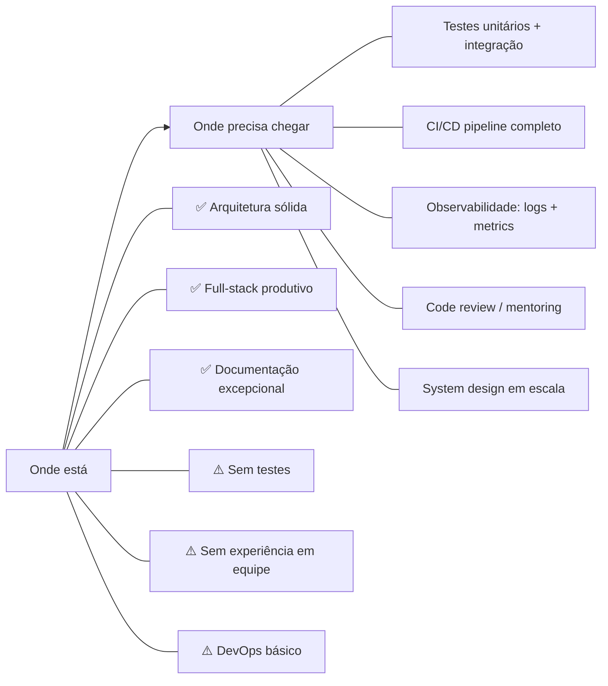

# 🔍 Perfil Profissional do Desenvolvedor — Análise Forense de Repositório

> **Sujeito:** Eduardo Nascimento (Havenox)
> **Repositório Analisado:** `media8-app-v1` — Plataforma SaaS para gestão de serviços de edição de vídeo
> **Data da Análise:** 18/05/2026
> **Método:** Inspeção forense de 40 commits, 262 arquivos, documentação técnica, arquitetura de código e padrões de trabalho

---

## 1. Radiografia do Repositório

### Números Frios

| Métrica | Valor |
|---------|-------|
| Total de Commits | 40 |
| Arquivos criados | 262 |
| Período de desenvolvimento ativo | 13/12/2025 → 18/05/2026 (~5 meses) |
| Sprint principal (burst) | 13-17/12/2025 (28 commits em 5 dias) |
| Documentos técnicos (case studies) | 25 |
| Controllers (API) | 6 |
| Páginas (Frontend) | 15+ |
| Entidades de domínio | 9 |
| Hooks customizados | 8 |
| Linhas de documentação técnica | ~1.000+ |

### Padrão de Horários de Commit

```
📊 Distribuição Horária (UTC-3)
───────────────────────────────
19h-23h: ████████████████████████ 24 commits (60%) → Noturno heavy
00h-05h: █████████ 9 commits (22%) → Madrugador
07h-11h: ██████ 6 commits (15%) → Manhã esporádica
```

**Perfil:** Desenvolvedor nocturno com picos extremos de produtividade entre 21h-23h. Trabalha forte nos finais de semana (Sunday: 11, Saturday: 9). Indica um perfil autodidata, empreendedor ou desenvolvedor que mantém projetos paralelos fora do horário comercial.

---

## 2. Análise Técnica Profunda

### 2.1. Stack Dominada (Evidenciada no Código)

#### Backend — .NET / C# ⭐⭐⭐⭐ (4/5)

| Aspecto | Evidência | Nível |
|---------|-----------|-------|
| **Clean Architecture** | Separação em 4 projetos: Api, Application, Domain, Infrastructure. Dependências fluem corretamente para dentro | ✅ Sólido |
| **DTOs e Segurança** | DTOs específicos de entrada/saída em cada endpoint. Anti Mass Assignment | ✅ Acima da média |
| **Patterns** | Repository, DI nativo, JWT, RBAC com tabela segregada | ✅ Sólido |
| **EF Core** | IQueryable para queries server-side, migrations gerenciadas, seed via JSON | ✅ Competente |
| **Ponto fraco** | Exception handling via `throw new Exception()` genérico (sem custom exceptions). CORS `AllowAll` em produção | ⚠️ Dívida técnica consciente |

> **Veredicto Backend:** Demonstra compreensão real de arquitetura enterprise .NET, não apenas uso de scaffold. O Snapshot Pattern e o motor FIFO são implementações não-triviais que mostram capacidade de modelagem de domínio.

#### Frontend — React / TypeScript ⭐⭐⭐⭐ (4/5)

| Aspecto | Evidência | Nível |
|---------|-----------|-------|
| **React 18 + TypeScript** | 15+ páginas, tipagem consistente, componentes organizados por feature | ✅ Sólido |
| **TanStack Query** | Hooks customizados (useOrders, useUsers, etc.) com server state management | ✅ Moderno |
| **Componentização** | InfiniteScroll genérico, InfiniteCombobox, ProtectedRoute, BrandLogo | ✅ DRY |
| **UI/UX** | shadcn/ui + Tailwind + Radix + Framer Motion + Recharts | ✅ Premium |
| **Formulários** | React Hook Form + Zod validation + Debounce | ✅ Profissional |
| **Ponto fraco** | Páginas com componentes muito grandes (LandingPage 28KB, OrderDetailPage 20KB) | ⚠️ Refatoração pendente |

> **Veredicto Frontend:** Não é um "dev que copia template". Os 270 linhas do serviceBalanceService demonstram lógica de negócio complexa no frontend (FIFO, aggregation, sort por urgência). Isso mostra maturidade.

#### Infraestrutura & DevOps ⭐⭐⭐ (3/5)

| Aspecto | Evidência | Nível |
|---------|-----------|-------|
| **Docker** | Dockerfiles para API e Web, docker-compose parametrizado com env vars | ✅ Funcional |
| **Nginx** | Reverse proxy configurado | ✅ Básico |
| **CI/CD** | Pasta `.github` com thumbnail apenas, sem Actions configuradas | ⚠️ Ausente |
| **Testes** | Zero testes automatizados no repo | 🔴 Ausente |
| **Monitoring** | Sem logging estruturado ou health checks | ⚠️ Ausente |

#### Banco de Dados — PostgreSQL ⭐⭐⭐⭐ (4/5)

| Aspecto | Evidência | Nível |
|---------|-----------|-------|
| **Schema design** | ENUMs nativos, triggers automáticos, índices estratégicos documentados | ✅ Acima da média |
| **Integridade** | FKs, CHECK constraints, RLS policies documentadas | ✅ Sólido |
| **Performance** | Índices FIFO compostos, paginação server-side | ✅ Consciente |

---

### 2.2. Qualidade dos Commits

```
📝 Análise de Mensagens de Commit
──────────────────────────────────
✅ Conventional Commits: feat(), fix(), refactor(), chore(), perf(), doc()
✅ Escopo definido: (web), (api), (api,web), (infra), (branding)
✅ Referências cruzadas: (ref: doc-012), (ref: doc-016)
✅ Narrativa clara: cada commit conta o que, por que e como
⚠️ Idioma misto: PT-BR com termos técnicos em inglês (aceitável)
```

**Exemplo de commit exemplar:**
```
refactor(web): (ref: doc-012) criar um combobox generico de scroll 
infinito plug&play e aplicar a um userSelect para atribuicao de 
pacotes à usuario na tela de gestão de pacotes
```

> **Nota:** 90% dos commits possuem contexto suficiente para ser entendido sem abrir o diff. Isso é raro e denota maturidade.

### 2.3. Cultura de Documentação — O Diferencial Brutal

Esta é a competência mais rara e valiosa encontrada neste repositório.

| Documento | Propósito | Qualidade |
|-----------|-----------|-----------|
| `MASTER_BLUEPRINT.md` | Guia central de 256 linhas com regras absolutas do projeto, stack, patterns, roadmap | ⭐⭐⭐⭐⭐ |
| `ARCHITECTURE.md` | Diagramas Mermaid de fluxo, clean architecture, domain modeling | ⭐⭐⭐⭐ |
| `DATABASE_SCHEMA.md` | Schema completo com justificativas de design para cada tabela | ⭐⭐⭐⭐ |
| `SECURITY.md` | Defense-in-depth, RBAC, anti-patterns, checklist de deploy | ⭐⭐⭐⭐ |
| `API_ROUTES.md` | Contrato de API com exemplos de payload | ⭐⭐⭐⭐ |
| 25× Case Studies | Problema → Solução → Impacto para cada bug/refatoração não-trivial | ⭐⭐⭐⭐⭐ |
| `Backlog` | User Stories estruturadas com épicos, critérios de aceite e tags de status | ⭐⭐⭐⭐ |
| `Briefing da Marca` | Paleta de cores, tipografia, diretrizes visuais | ⭐⭐⭐ |

> [!IMPORTANT]
> **25 Case Studies de implementação** é extraordinário para um desenvolvedor solo. Cada documento segue o formato: Desafio → Estratégia → Implementação Técnica → Impacto. Isso demonstra um profissional que trata código como produto de engenharia, não como output descartável.

---

## 3. Perfil Comportamental e Cultural

### 3.1. Características Observadas

| Traço | Evidência | Intensidade |
|-------|-----------|-------------|
| **Autodidatismo** | Usou .NET 10 Preview, tecnologias de ponta, aprendeu padrões como Snapshot/FIFO sozinho | 🔥🔥🔥🔥🔥 |
| **Ownership** | 100% dos 40 commits são de um único autor. Zero dependência de equipe | 🔥🔥🔥🔥🔥 |
| **Obsessão por documentação** | 25 case studies, blueprint completo, backlog estruturado | 🔥🔥🔥🔥🔥 |
| **Pensamento de produto** | README pensado como portfólio, branding implementado, landing page funcional | 🔥🔥🔥🔥 |
| **Perfeccionismo técnico** | Refatorações progressivas (doc-010 → doc-025), pattern incremental | 🔥🔥🔥🔥 |
| **Visão de negócio** | Backlog com user stories reais, fluxos de criação de pedido detalhados | 🔥🔥🔥🔥 |
| **Disciplina de horário** | Concentra trabalho em noites e fins de semana (side project ou freelancer) | 🔥🔥🔥 |

### 3.2. Fit Cultural

| Cultura de Empresa | Fit |
|--------------------|----|
| **Startup early-stage** (precisa de alguém que construa tudo do zero) | ⭐⭐⭐⭐⭐ Perfeito |
| **Scale-up** (produto em crescimento, precisa de arquitetura e documentação) | ⭐⭐⭐⭐⭐ Perfeito |
| **Consultoria/Software House** (múltiplos projetos, autonomia) | ⭐⭐⭐⭐ Muito bom |
| **Corporação** (processos rígidos, code review, pair programming) | ⭐⭐⭐ Bom (se a cultura valoriza autonomia) |
| **Big Tech** (FAANG-like, processos LeetCode-heavy) | ⭐⭐ Neutro (perfil mais pragmático que teórico) |

### 3.3. Red Flags / Pontos de Atenção

| Ponto | Detalhe |
|-------|---------|
| ⚠️ **Zero testes** | Nenhum teste unitário ou de integração. O roadmap menciona como Fase 2, mas não foi executado. Em equipe, isso seria bloqueante |
| ⚠️ **CORS AllowAll** | Aceitável em dev, mas precisa ser fechado para produção |
| ⚠️ **Exception handling genérico** | `throw new Exception()` em vez de exceções tipadas com middleware de erro. Funcional, mas não production-grade |
| ⚠️ **Commits em burst** | 28 commits em 5 dias, depois 5 meses de gap. Indica padrão de hype-cycle ou projeto paralelo. Pode ser um desafio de consistência em equipe |
| ⚠️ **Trabalha sozinho** | Toda evidência é de work-in-isolation. Não há PRs, code reviews ou colaboração documentada. Precisaria validar habilidades de trabalho em equipe |

---

## 4. Scorecard Final

### Pontuação por Competência (0-10)

| Competência | Nota | Justificativa |
|-------------|------|---------------|
| **Arquitetura de Software** | 8.0 | Clean Architecture aplicada corretamente, Snapshot Pattern, separação de concerns |
| **Backend (.NET/C#)** | 7.5 | Sólido em patterns e EF Core. Perde pontos por falta de testes e error handling |
| **Frontend (React/TS)** | 7.5 | UI premium, hooks customizados, lógica de negócio no frontend. Perde por componentes grandes |
| **Banco de Dados (SQL)** | 7.0 | Schema bem desenhado com triggers e índices. Faltam migrations mais complexas |
| **DevOps/Infra** | 5.0 | Docker funcional, mas sem CI/CD, testes, monitoring ou health checks |
| **Documentação** | 9.5 | Excepcional. 25 case studies + blueprint + backlog. Top 5% dos devs que vi |
| **Comunicação Técnica** | 9.0 | Commits narrativos, docs claros, README como portfólio |
| **Visão de Produto** | 8.0 | Backlog estruturado, user stories reais, branding consistente |
| **Autonomia** | 9.5 | Construiu full-stack + infra + docs sozinho. Auto-starter extremo |
| **Trabalho em equipe** | N/A | Sem evidência suficiente para avaliar |

### Nota Geral Ponderada

```
╔══════════════════════════════════╗
║                                  ║
║   NOTA GERAL:  7.8 / 10         ║
║   TIER:  B+ (Acima da Média)    ║
║                                  ║
╚══════════════════════════════════╝
```

---

## 5. Posicionamento no Mercado

### Cargo Ideal

| Cargo | Fit | Comentário |
|-------|-----|------------|
| **Desenvolvedor Full Stack Pleno** | ⭐⭐⭐⭐⭐ | Este é o encaixe natural atual. Domina front + back com autonomia |
| **Desenvolvedor Full Stack Sênior** | ⭐⭐⭐⭐ | Precisa apenas de experiência em equipe, testes e observabilidade para justificar |
| **Tech Lead de squad pequeno** | ⭐⭐⭐ | A documentação e visão de produto sustentam, mas falta histórico de liderança |
| **Backend Engineer (.NET)** | ⭐⭐⭐⭐ | Forte, mas o diferencial dele é ser full-stack. Especializar seria subutilizar |

### Faixa Salarial Estimada (Mercado Brasil — Mai/2026)

> [!NOTE]
> Estimativas baseadas no mercado brasileiro para desenvolvedor Full Stack .NET + React, considerando perfil PJ e CLT.

| Modelo | Faixa Mínima | Faixa Justa | Faixa Premium |
|--------|-------------|-------------|---------------|
| **CLT** | R$ 8.000 | **R$ 10.000 – R$ 13.000** | R$ 15.000 |
| **PJ** | R$ 12.000 | **R$ 15.000 – R$ 18.000** | R$ 22.000 |
| **Remoto Internacional (USD)** | $3.000 | **$4.000 – $5.500** | $7.000 |

**Justificativa:** O diferencial salarial não vem do código (que é bom, mas não excepcional). Vem da capacidade de construir produto de ponta a ponta com documentação exemplar. Empresas que valorizam autonomia pagariam premium.

### Como Subir para Sênior (Gap Analysis)



| Gap | Ação Recomendada | Impacto na Carreira |
|-----|------------------|---------------------|
| **Testes** | Implementar xUnit no backend e Vitest/Playwright no frontend deste projeto | 🔥 Alto — é o bloqueador #1 para sênior |
| **CI/CD** | GitHub Actions com build + test + deploy automatizado | 🔥 Alto — completa o ciclo DevOps |
| **Observabilidade** | Serilog + Seq ou OpenTelemetry no .NET | 🔥 Médio-Alto |
| **Contribuição open-source** | PRs em projetos shadcn/ui ou TanStack | 🔥 Médio — valida colaboração |
| **System Design** | Estudar design de sistemas distribuídos (mensageria, CQRS real, event sourcing) | 🔥 Médio — diferencia sênior de pleno |

---

## 6. Conclusão

Eduardo Nascimento (Havenox) é um **desenvolvedor full-stack pleno com forte tendência a sênior**, cujo diferencial não está em dominar uma tecnologia específica, mas na capacidade rara de **construir produto completo com consciência arquitetural e documentação de engenharia**.

O repositório Media8 não é um tutorial copiado — é um sistema real com modelagem de domínio não-trivial (Snapshot, FIFO, RBAC segregado), frontend moderno e profissional, e uma cultura de documentação que supera a média de equipes inteiras.

### O que falta para o próximo nível:
1. **Testes** (automatizados, não manuais)
2. **Experiência em equipe** (code review, PRs, mentoria)
3. **DevOps completo** (CI/CD, monitoring, alertas)

### Veredicto Final:

> *"Este é o tipo de desenvolvedor que você contrata para construir a v1 de um produto e sabe que quando sair de férias, outra pessoa vai conseguir entender o código."*

---

> *"Gambiarra só é aceitável se for pra manter o sistema respirando até o fix."* — Havenox

