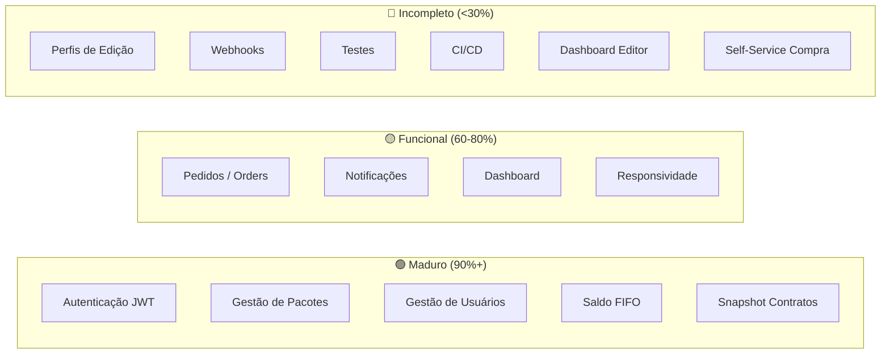

# 📋 Media 8 — Relatório Completo de Status do Projeto

> **Data do Checkup:** 18/05/2026  
> **Repositório:** `media8-app-v1` (Monorepo)  
> **Desenvolvedor:** Eduardo Nascimento (Havenox)

---

## 1. Visão Geral do Produto

O **Media 8** é uma plataforma SaaS para **Gestão, Venda e Entrega de Serviços de Edição de Vídeo**, conectando Clientes a Editores Profissionais. Cobre o ciclo completo: compensação financeira (saldo/créditos) → esteira de produção (upload, revisão, entrega).

### Stack Tecnológico

| Camada | Tecnologia |
|--------|-----------|
| **Backend** | .NET 10 (Preview), C# 13, ASP.NET Core Web API, EF Core 10, PostgreSQL |
| **Frontend** | React 18, TypeScript, Vite, TanStack Query, Tailwind CSS, shadcn/ui, Radix, React Hook Form + Zod |
| **Infra** | Docker, Docker Compose, Nginx Reverse Proxy |

---

## 2. O Que JÁ FOI FEITO ✅

Com base nos 25 documentos de implementação e análise do código-fonte, este é o inventário completo do que está implementado:

### 2.1 Arquitetura & Infraestrutura

| Feature | Status | Docs |
|---------|--------|------|
| Clean Architecture (Api → Application → Domain → Infrastructure) | ✅ Completo | [ARCHITECTURE.md](file:///g:/DEV/Media8/media8-app-v1/docs/ARCHITECTURE.md) |
| Monorepo com 3 projetos (`media8-api`, `media8-web`, `media8-infra`) | ✅ Completo | — |
| Docker Compose + Nginx Reverse Proxy | ✅ Completo | `media8-infra/` |
| PostgreSQL Dockerizado com migrations EF Core | ✅ Completo | — |
| Identidade visual definida (paleta Vinho `#400404`, tipografia) | ✅ Completo | [Briefing](file:///g:/DEV/Media8/media8-app-v1/docs/Briefing%20da%20Marca%20-%20Diretrizes%20da%20Identidade%20Visual.md) |

### 2.2 Backend — Controllers & Módulos

| Controller | Endpoints | Status | Observações |
|------------|----------|--------|-------------|
| `AuthController` | `POST /auth/login` | ✅ | JWT + HMACSHA256 |
| `UsersController` | CRUD + Listagem paginada + Stats | ✅ | Admin-only, DTOs segregados |
| `PackagesController` | CRUD + Safe Delete + Filtros | ✅ | Suporte a pacotes privados |
| `PackageAssignmentsController` | Criação de contratos + Snapshots | ✅ | Padrão Snapshot imutável |
| `ServiceBalancesController` | `GET /my-balances`, `POST /consume` | ✅ | Algoritmo FIFO |
| `OrdersController` | CRUD de pedidos de edição | ✅ | Integração com consumo de saldo |

### 2.3 Frontend — Páginas Implementadas

| Página | Arquivo | Tamanho | Status |
|--------|---------|---------|--------|
| **Landing Page** | `LandingPage.tsx` | 28KB | ✅ Completa |
| **Login** | `LoginPage.tsx` | 10.5KB | ✅ |
| **Signup** | `SignupPage.tsx` | 12.7KB | ✅ |
| **Dashboard** | `DashboardPage.tsx` | 17.2KB | ✅ |
| **Gestão de Pacotes (Admin)** | `admin/PackagesPage.tsx` | 33.8KB | ✅ Robusta |
| **Gestão de Usuários (Admin)** | `UsersPage.tsx` | 20.2KB | ✅ |
| **Meus Serviços** | `ServicesPage.tsx` | 10.5KB | ✅ |
| **Pedidos (Orders)** | `OrdersPage.tsx` | 10KB | ✅ |
| **Novo Pedido** | `NewOrderPage.tsx` | 18.5KB | ✅ |
| **Detalhe do Pedido** | `OrderDetailPage.tsx` | 20.2KB | ✅ |
| **Edições** | `EditsPage.tsx` | 12.3KB | ✅ |
| **Configurações** | `SettingsPage.tsx` | 16.7KB | ✅ |
| **Notificações** | `NotificationsPage.tsx` | 7.8KB | ✅ |
| **Access Denied** | `AccessDeniedPage.tsx` | 2.3KB | ✅ |
| **404 Not Found** | `NotFound.tsx` | 1.8KB | ✅ |

### 2.4 Patterns & Engenharia de Qualidade

| Pattern/Feature | Implementação | Doc Ref |
|----------------|---------------|---------|
| **Snapshot Pattern** (Contratos imutáveis) | ✅ | [016](file:///g:/DEV/Media8/media8-app-v1/docs/implementations/016-arquitetura-snapshot-contratos.md), [024](file:///g:/DEV/Media8/media8-app-v1/docs/implementations/024-correcao-imutabilidade-contrato.md) |
| **Balance FIFO** (Consumo de créditos) | ✅ | [001](file:///g:/DEV/Media8/media8-app-v1/docs/implementations/001-consumo-saldo-servicos.md) |
| **DTO Pattern** (Anti Over-posting) | ✅ | [002](file:///g:/DEV/Media8/media8-app-v1/docs/implementations/002-fix-referencia-circular-atribuicao.md), [007](file:///g:/DEV/Media8/media8-app-v1/docs/implementations/007-gestao-usuarios.md) |
| **Safe Delete** (Validação de dependências) | ✅ | [003](file:///g:/DEV/Media8/media8-app-v1/docs/implementations/003-seguranca-delecao-pacotes.md) |
| **Infinite Scroll** (Componente genérico) | ✅ | [010](file:///g:/DEV/Media8/media8-app-v1/docs/implementations/010-refatoracao-infinite-scroll-generico.md) |
| **InfiniteCombobox** (Select virtualizado) | ✅ | [012](file:///g:/DEV/Media8/media8-app-v1/docs/implementations/012-otimizacao-packages-user-select.md) |
| **Server-Side Search** (IQueryable + Debounce) | ✅ | [011](file:///g:/DEV/Media8/media8-app-v1/docs/implementations/011-busca-server-side-otimizada.md) |
| **Lazy Loading On-Demand** | ✅ | [013](file:///g:/DEV/Media8/media8-app-v1/docs/implementations/013-otimizacao-users-package-select.md) |
| **Defensive Date Handling** | ✅ | [014](file:///g:/DEV/Media8/media8-app-v1/docs/implementations/014-fix-invalid-date-crash.md) |
| **Centralização de Paginação** (DRY) | ✅ | [022](file:///g:/DEV/Media8/media8-app-v1/docs/implementations/022-centralizacao-paginacao.md) |
| **Polimorfismo Visual** (List/Grid variant) | ✅ | [019](file:///g:/DEV/Media8/media8-app-v1/docs/implementations/019-ux-redesign-service-list.md) |
| **Suporte Shorts/Reels** (Segundos) | ✅ | [005](file:///g:/DEV/Media8/media8-app-v1/docs/implementations/005-refatoracao-duracao-segundos.md) |
| **Responsividade Mobile** (Sidebar→Drawer) | ✅ | [Responsividade.md](file:///g:/DEV/Media8/media8-app-v1/docs/Responsividade.md) |
| **Bulk Seeder Otimizado** (HashSet O(1)) | ✅ | [009](file:///g:/DEV/Media8/media8-app-v1/docs/implementations/009-json-user-seeder.md) |

### 2.5 Segurança Implementada

| Vetor | Proteção | Status |
|-------|----------|--------|
| Autenticação | JWT (HMACSHA256) com Access + Refresh Token | ✅ |
| Autorização | RBAC (admin, editor, client) via `user_roles` | ✅ |
| SQL Injection | EF Core LINQ (queries parametrizadas) | ✅ |
| XSS | React auto-escaping + CSP Headers | ✅ |
| CSRF | JWT em Header (não cookies) | ✅ |
| IDOR | Ownership validation via JWT Claims | ✅ |
| Over-posting | DTOs estritos por endpoint | ✅ |
| Replay Attacks | Token expiration (`exp` + `iat`) | ✅ |

### 2.6 Bugs Resolvidos (Histórico)

| # | Bug | Causa Raiz | Fix |
|---|-----|-----------|-----|
| 002 | Stack Overflow na serialização | Referência circular EF Core → JSON | DTO Pattern |
| 004 | Filtro de categorias "não funciona" | Case sensitivity (`Assinatura` vs `assinatura`) | `.toLowerCase()` bilateral |
| 006 | Pacotes privados bloqueados para admin | Guarda UI excessiva | Remoção de `disabled` contextual |
| 008 | Estatísticas mostrando "20" em vez do total | Contagem no frontend paginado | Endpoint `COUNT(*)` server-side |
| 014 | Tela branca (WSOD) | `Invalid Date` crashava React | `safeFormatDate` defensivo |
| 018 | Validade de pacote não aplicada | DTO não propagava `validityDays` | Fix no mapeamento do DTO |
| 021 | Infinite scroll quebra em produção | CORS remove header `x-total-count` | Inferência por array length |
| 023 | "Membro desde" aparece como `–` | `CreatedAt` ausente no DTO | Extensão do `AdminUserDto` |
| 024 | Nome do pacote muda retroativamente | JOIN direto com catálogo | Fallback Coalescing (Snapshot → Package → "Unknown") |

---

## 3. O Que ESTAVA PLANEJADO (Documentado, mas status incerto) 🔶

Com base na documentação arquitetural e fluxos descritos, estes módulos foram **projetados** mas precisam de verificação de completude no código:

### 3.1 Módulo de Pedidos (Orders) — Esteira de Produção

| Feature | Documentação | Status Código |
|---------|-------------|---------------|
| Criação de pedido com consumo FIFO | ✅ Docs + Fluxo detalhado | ✅ Implementado (`NewOrderPage`, `OrdersController`) |
| `OrderTimeline` (log de eventos) | Mencionado no schema ER | 🔶 **Entity existe** (`OrderAggregate.cs`) mas sem controller/endpoint dedicado |
| Status flow (`pending→in_progress→review→done`) | Schema define `order_status` enum | 🔶 Parcialmente (ver `OrderDetailPage`) |
| Atribuição de editor ao pedido | Schema tem `editor_id` nullable | 🔶 Provavelmente implementado no `OrderDetailPage` |
| Upload de arquivos finais (`final_video_url`) | Campo existe no schema | 🔶 Campo no DB, mas fluxo de upload não documentado |

### 3.2 Perfis de Edição (Editing Profiles)

| Feature | Documentação | Status Código |
|---------|-------------|---------------|
| Briefing com estilo desejado, referências visuais/sonoras | Descrito em [fluxo-geral](file:///g:/DEV/Media8/media8-app-v1/docs/fluxo-geral-do-usuario-gerenciador-de-edicao.md) | ⚠️ **NÃO encontrado no código** — sem entity, sem controller, sem página |
| Seleção de perfil na criação de pedido | Descrito em [fluxo-pedido](file:///g:/DEV/Media8/media8-app-v1/docs/fluxo-de-criacao-de-pedido-detalhado.md) | ⚠️ **NÃO implementado** |
| CRUD de perfis de edição | Descrito nos fluxos | ⚠️ **NÃO implementado** |

### 3.3 Webhooks & Integrações

| Feature | Documentação | Status Código |
|---------|-------------|---------------|
| Fire-and-forget para n8n/Zapier | Descrito em [ARCHITECTURE.md](file:///g:/DEV/Media8/media8-app-v1/docs/ARCHITECTURE.md) | 🔶 Variável `WEBHOOK_NOTIFICATION_URL` mencionada, mas sem implementação visível nos controllers |
| Eventos: Venda, Pedido Criado, Status Alterado | Descrito na arquitetura | 🔶 **Sem evidência de implementação** |

### 3.4 Notificações

| Feature | Documentação | Status |
|---------|-------------|--------|
| Entity `Notification` | ✅ Existe em `Media8.Domain/Entities/Notification.cs` | ✅ |
| Contexto de Notificações no frontend | ✅ `NotificationsContext.tsx` | ✅ |
| Página de Notificações | ✅ `NotificationsPage.tsx` (7.8KB) | ✅ |

---

## 4. O Que Está FALTANDO ❌

### 4.1 Features de Negócio Críticas (Prioridade Alta)

| # | Feature | Impacto | Esforço Estimado |
|---|---------|---------|------------------|
| **F1** | **Perfis de Edição** (Editing Profiles) — Entity, CRUD, seleção no pedido | 🔴 Core do produto. Sem isso, clientes não conseguem expressar briefing reutilizável | Alto |
| **F2** | **Webhooks** — Disparo de eventos para n8n/Zapier | 🟡 Automação de marketing e CRM desacoplado | Médio |
| **F3** | **Refresh Token completo** — Rotação documentada, endpoint de refresh | 🟡 Segurança em produção (sessão expira sem aviso) | Médio |
| **F4** | **Fluxo de Upload real** — Upload de materiais brutos (Google Drive ou S3) | 🟡 Atualmente é só um campo de URL | Médio-Alto |
| **F5** | **Order Timeline** — Endpoint e UI de histórico de eventos do pedido | 🟡 Tracking granular da produção | Médio |

### 4.2 Features Técnicas (Prioridade Média)

| # | Feature | Impacto |
|---|---------|---------|
| **T1** | **Testes automatizados** — Nenhum teste unitário ou de integração encontrado | 🔴 Risco de regressão alto |
| **T2** | **CI/CD Pipeline** — GitHub Actions mencionado no README como "exemplo" | 🟡 Sem deploy automatizado |
| **T3** | **Soft Delete / Audit Trail** — Mencionado em SECURITY.md mas inconsistente na implementação | 🟡 |
| **T4** | **RLS no PostgreSQL** — Mencionado em SECURITY.md como estratégia, mas não evidenciado nas migrations | 🟡 |
| **T5** | **Expiração automática de lotes** — `expires_at` existe no schema mas sem job/cron de limpeza | 🟡 Lotes expirados podem ser consumidos |
| **T6** | **Logging estruturado** (Serilog/OpenTelemetry) — Mencionado pontualmente mas sem infraestrutura | 🟡 |
| **T7** | **Error Boundary global** no React | 🟢 Há `safeFormatDate` mas sem ErrorBoundary genérico |

### 4.3 Features de UX/Produto (Prioridade Baixa → Média)

| # | Feature | Status |
|---|---------|--------|
| **U1** | **Dashboard do Editor** — Visão de pedidos atribuídos, workflow de edição | ❌ Não existe |
| **U2** | **Dashboard do Cliente** — Visão consolidada de saldo, pedidos ativos | 🔶 `DashboardPage` existe (17KB), verificar completude |
| **U3** | **Landing Page pública de pacotes** — `GET /packages` está público mas integração na Landing Page | ✅ `LandingPage.tsx` (28KB) |
| **U4** | **Fluxo de compra self-service** — Cliente compra pacote direto (sem admin atribuir) | ❌ Não implementado |
| **U5** | **Sistema de avaliação/feedback do vídeo entregue** | ❌ Não existe |
| **U6** | **Esqueci minha senha / Reset password** | ❌ Não encontrado |
| **U7** | **Email transacional** (confirmação de conta, reset, notificação de pedido) | ❌ Não implementado |

---

## 5. Mapa de Maturidade por Módulo

---

## 6. Cronologia de Desenvolvimento

Com base nas datas dos documentos de implementação:

| Data | Implementações | Fase |
|------|---------------|------|
| **13/12/2025** | 001→006 | Foundation: FIFO, DTOs, Safe Delete, Filtros, Segundos, Pacotes Privados |
| **14/12/2025** | 007→010 | Admin: Gestão Usuários, Stats Server-Side, Seeder, Infinite Scroll |
| **15/12/2025** | 011→013 | Performance: Busca Server-Side, Selects Virtualizados, Lazy Loading |
| **16/12/2025** | 014→019 | Qualidade: Resiliência Dates, Snapshot Architecture, UX Redesign |
| **17/12/2025** | 020→025 | Polish: Dead Code, CORS Fix, DRY, DTO Extension, Imutabilidade, UX Minimal |
| **18/12/2025 →** **hoje** | ? | ⚠️ **Sem documentação de implementações posteriores** |

> [!WARNING]
> O desenvolvimento documentado cobre apenas **5 dias intensos** (13→17/12/2025). Desde então (~5 meses), não há novos documentos de implementação. Pode haver código novo não documentado, ou o projeto foi pausado.

---

## 7. Roadmap Recomendado para Prosseguir

### Fase 1 — Consolidação (Semanas 1-2)

> [!IMPORTANT]
> Antes de adicionar features novas, solidificar o que já existe.

- [ ] **Auditoria do código atual** — Verificar se o código reflete 100% o que a documentação descreve
- [ ] **Adicionar testes** — No mínimo: testes de integração para o fluxo FIFO de consumo e Snapshot
- [ ] **Error Boundary** global no React
- [ ] **Expiração de lotes** — Job/cron ou middleware que invalida lotes expirados
- [ ] **Refresh Token** — Implementar endpoint `/auth/refresh` com rotação
- [ ] **Reset de senha** — `POST /auth/forgot-password` + `POST /auth/reset-password`

### Fase 2 — Core Feature Pendente (Semanas 3-5)

- [ ] **Perfis de Edição** — Entity, Migration, Controller, CRUD Frontend, integração no fluxo de pedido
- [ ] **Order Timeline** — Endpoint `/orders/:id/timeline`, UI de histórico
- [ ] **Dashboard do Editor** — Página dedicada com pedidos atribuídos

### Fase 3 — Automação & Integração (Semanas 6-7)

- [ ] **Webhooks** — Implementar `IWebhookService` com Fire-and-Forget para eventos chave
- [ ] **Email transacional** — Integração com SendGrid/Resend para notificações
- [ ] **CI/CD** — GitHub Actions pipeline (build → test → deploy staging)

### Fase 4 — Growth & Self-Service (Semanas 8-10)

- [ ] **Gateway de pagamento** — Integração Stripe/Mercado Pago para compra self-service
- [ ] **Fluxo de compra** — Cliente seleciona pacote → paga → recebe créditos automaticamente
- [ ] **Landing Page com catálogo interativo** — Conectar `GET /packages` com CTA de compra

### Fase 5 — Escala & Observabilidade (Contínuo)

- [ ] **Logging estruturado** (Serilog → Seq ou Elastic)
- [ ] **Monitoramento** (Health checks, métricas de performance)
- [ ] **RLS no PostgreSQL** (Row Level Security para multi-tenancy segura)
- [ ] **Sistema de avaliação** de vídeos entregues

---

## 8. Métricas do Projeto Atual

| Métrica | Valor |
|---------|-------|
| **Total de Páginas Frontend** | 15 |
| **Total de Controllers Backend** | 6 |
| **Total de Entidades de Domínio** | 5 (`User`, `Package/Assignment`, `ServiceBalanceLot`, `Order`, `Notification`) |
| **Implementações Documentadas** | 25 |
| **Bugs Corrigidos Documentados** | 9 |
| **Testes Automatizados** | 0 ⚠️ |
| **Cobertura de Deploy** | Docker local apenas |

---

## 9. Conclusão

O Media 8 tem uma **base sólida e bem arquitetada** — os padrões de Snapshot, FIFO, DTOs segregados e Clean Architecture são diferenciadores reais. A documentação é exemplar (25 case studies detalhados).

Os maiores gaps são:
1. **Perfis de Edição** — feature core documentada mas não implementada
2. **Testes** — zero cobertura, risco alto de regressão
3. **Infraestrutura de produção** — sem CI/CD, sem monitoramento, sem emails transacionais
4. **Self-service** — todo o fluxo de compra depende de admin manual

O projeto está numa fase de **MVP funcional** para operação assistida (admin faz tudo), mas precisa evoluir para um produto **self-service** para escalar.
